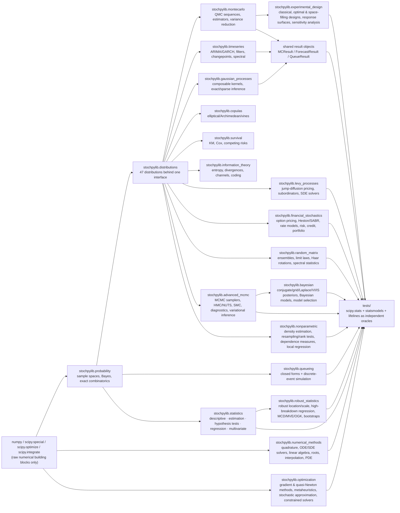
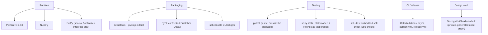

<p align="center">
  
</p>

<h1 align="center">stochpylib</h1>

<p align="center">
  <strong>Probability · Distributions · Monte Carlo — one coherent Python library, engineered to prove that a complete stochastic-computing stack can live in a single well-tested package.</strong>
</p>

<p align="center">
  
  
  
  <a href="https://github.com/leon1706-lol/Stochpylib/actions/workflows/ci.yml"></a>
  <a href="https://pypi.org/project/stochpylib/"></a>
  
</p>

<p align="center">
  
  
  
  
  
  
</p>

---

stochpylib is not a wrapper around existing statistical libraries — every distribution and
algorithm is implemented from scratch, with `scipy.special/optimize/integrate` used only as raw
numerical building blocks and `scipy.stats`, `statsmodels` and `lifelines` serving as
independent test oracles. At its core is a single load-bearing contract: every distribution
exposes the same method set
(`.pdf()/.cdf()/.ppf()/.rvs()/.mean()/.var()/.skewness()/.kurtosis()/.entropy()/.mgf()/.cf()/.fit()/.ks_test()`),
every stochastic method takes a `random_state=` seed, and every Monte Carlo estimator returns a
shared result object carrying its point estimate together with an honest standard error and
confidence interval. Around that contract, twenty modules are live today: a **probability
engine** (sample spaces, Bayes' theorem, exact-integer combinatorics, independence
testing), **47 distributions** across discrete/continuous/multivariate/heavy-tailed
families — including stable laws with Chambers–Mallows–Leckie sampling and numerically
inverted characteristic functions — a **Monte Carlo suite** spanning quasi-random
sequences (Sobol, Halton, Faure, Niederreiter), variance-reduction techniques (antithetic,
control variates, Latin hypercube, conditioned MC, rejection control), and applications
from option pricing validated against Black–Scholes to reliability analysis driven by the
library's own distribution objects, a **time-series toolkit** (ARIMA family, GARCH family,
Kalman/particle filters, HMMs, changepoints, spectral analysis), **Gaussian processes**
(a composable kernel zoo with exact, sparse and approximate-classification inference),
**survival analysis** (Kaplan-Meier, Cox regression, parametric censored fits, competing
risks), **queueing theory** (M/M/1 to Jackson networks with discrete-event simulation),
**copulas** (elliptical, Archimedean and empirical families plus C-/D-/R-vine dependence
models), **information theory** (entropy families, divergences, mutual information,
channel capacity, coding), **Lévy processes** (jump-diffusion pricing models, tempered
and stable subordinators, Hawkes/Cox/branching processes, SDE solvers from Euler-Maruyama
through strong order 1.5), **financial stochastics** (option pricing from closed-form
Black-Scholes to Heston/SABR/rough-volatility and Fourier methods, short-rate and LIBOR
market models, VaR/ES/stress risk, credit risk, portfolio construction) and **statistics**
(descriptive stats, MLE/MOM/Bayesian/bootstrap estimation, z/t/chi2/F/ANOVA/MANOVA/rank
tests, OLS/GLM/ridge/lasso/quantile regression, PCA/factor analysis/discriminant analysis/
clustering/MDS), **random matrix theory** (GOE/GUE/GSE, Wigner, Wishart and Ginibre-type
ensembles, the semicircle/Marchenko-Pastur/Tracy-Widom laws as full distributions, Haar
rotations, spacing and edge statistics), and **advanced MCMC** (Metropolis/Gibbs/adaptive
samplers, HMC/NUTS/MALA and Riemannian variants, slice samplers, parallel tempering,
sequential Monte Carlo, particle MCMC, reversible-jump samplers, R-hat/ESS diagnostics,
variational inference and planar normalizing flows), and **numerical methods** (Gauss
quadrature families, adaptive/composite integration, ODE solvers from Euler through
embedded Dormand-Prince and implicit BDF, SDE path solvers, native linear algebra —
matrix exponential/logarithm, eigendecomposition, SVD, QR, Schur — root finding,
spline/Chebyshev/NURBS interpolation, and finite-difference/finite-element/
boundary-element/spectral PDE tools), and **Bayesian inference** (priors/likelihoods/
posteriors with ten closed-form conjugate families, Laplace/expectation-propagation/
variational/importance-sampling posterior approximations, Bayesian linear/logistic
regression, naive Bayes, hierarchical models, finite mixtures, discrete Bayesian
networks, Dirichlet-process mixtures, and AIC/BIC/DIC/WAIC/PSIS-LOO/TIC model selection
with Bayes factors), and **robust statistics** (trimmed/winsorized means, median with a
Maritz-Jarrett standard error, Hodges-Lehmann, L/M/R-estimators, MAD/Qn/Sn/IQR/biweight/
tau/Huber scales, Theil-Sen, Siegel repeated-medians, RANSAC, FAST-LTS, FAST-S+MM and
Huber regression, FAST-MCD/MVE/OGK covariance, robust correlation, Ledoit-Wolf/OAS/
constant-correlation shrinkage, and robust/wild/block/stationary bootstraps), and
**nonparametric methods** (kernel/adaptive/kNN/orthogonal-series/log-spline density
estimation satisfying the full distribution contract, empirical distribution/CDF/
characteristic-function estimators, Glivenko-Cantelli bounds, Owen's empirical
likelihood, permutation/bootstrap/Mood/Kruskal-Wallis/Friedman/sign/runs/
Anderson-Darling/Cramer-von Mises tests, Spearman/Kendall/distance/Hoeffding
dependence measures, local-polynomial/isotonic/spline/quantile regression), and
**stochastic & numerical optimization** (gradient descent and the adaptive-step family,
Newton/BFGS/L-BFGS/conjugate-gradient/trust-region/Levenberg-Marquardt, simulated
annealing, genetic algorithms, particle swarm, differential evolution, ant colony,
CMA-ES, GP-surrogate Bayesian optimization, Robbins-Monro/Kiefer-Wolfowitz/SPSA
stochastic approximation, the cross-entropy method, sample-average approximation with an
optimality-gap interval, and penalty/augmented-Lagrangian/active-set/interior-point
constrained solvers), and **design of experiments** (full/fractional factorials with
resolution and alias structure, Plackett-Burman, central composite and Box-Behnken
designs, Latin and Graeco-Latin squares, D/A/G/I/T- and Bayesian optimal designs, Latin
hypercube/maximin/minimax/uniform/orthogonal-array space-filling designs, response surfaces
with canonical analysis and lack-of-fit ANOVA, polynomial chaos expansions, universal
kriging surrogates, DOE ANOVA, Lenth's method, and Morris/Sobol sensitivity analysis). The
roadmap takes it onward through spatial statistics, visualization and utilities (23
modules, ~794 public names planned). The
[Architecture](#architecture) section
below has the structural picture; [`development/architecture.md`](development/architecture.md)
goes deeper still.

## Known Limitations

- **PyPI lags the repository.** The latest published release is `0.6.4`; the code here is at
  `0.17.0`. Releases are tag-triggered (see [Release Process](#release-process)) and no tag has
  been pushed since the early modules — `pip install stochpylib` gets 0.6.4, so for the
  current state of the library, install from source (`pip install -e .`).
- **3 of 23 planned modules remain.** The implemented twenty are complete and tested against
  their spec; everything else in the roadmap is design spec, not shipped code. Exact
  per-name state: [`development/Implementation-Checklist.md`](development/Implementation-Checklist.md).
- **`statistics`'s two-sample KS p-value uses the classical asymptotic formula**, not
  `scipy.stats.ks_2samp`'s finite-sample `kstwo` refinement (no `scipy.special` equivalent
  exists) — see `stochpylib/statistics/README.md`.
- **The multivariate distributions deviate from the common interface by design** — the 7
  multivariate classes expose `.pdf()` instead of `.pmf()` and omit scalar-argument
  `.mgf()/.cf()`. This is the one sanctioned deviation, asserted as such in the conformance
  tests.
- **GP expectation propagation is experimental** — documented convergence issues; prefer
  Laplace or variational inference (see `stochpylib/gaussian_processes/README.md`).
- **Gradient-based MCMC has no autodiff.** `advanced_mcmc` takes an optional
  `grad_log_prob=`; without it HMC/NUTS/MALA fall back to central finite differences
  (`2 * dim` density evaluations per gradient) — see `stochpylib/advanced_mcmc/README.md`.
- **`numerical_methods`'s `FEniCS_Interface` never depends on FEniCS** — it solves
  natively via the module's own `FiniteElement` by default, and only lazily imports
  dolfinx/dolfin for `.to_fenics()` (a clear `ImportError` otherwise); its BDF solver is
  fixed-step and its 2-D finite elements/boundary elements are P1-only — see
  `stochpylib/numerical_methods/README.md`.
- **The full test suite is heavy** — statistical convergence tests (GARCH fits, VARMA
  estimation, vine copulas) put it in the tens of minutes on a laptop. CI runs the same
  suite on every push, so a locally slow but green run is normal; a red run is not.
- **`bayesian` has no autodiff and no general-purpose PPL.** Non-conjugate posteriors go
  through a numerical grid (dim <= 2), Laplace, variational inference (the reported
  evidence is the ELBO, a lower bound), importance sampling, or `advanced_mcmc` samplers
  with finite-difference gradients; `EP_Posterior` covers Gaussian-prior, single
  linear-projection-site models (any analytically evaluable site, via Gauss-Hermite
  quadrature — not limited to Gaussian-conjugate ones); `MixtureModel`/`DirichletProcess`
  cover gaussian and 1-D poisson families only; `BayesianNetwork` is discrete-only — see
  `stochpylib/bayesian/README.md`.
- **`robust_statistics`'s randomized estimators are seeded, not exact.** `MCD`/`MVE`/
  `LTS_Regression`/`MMRegression`/`RANSACRegression` and multi-predictor `TheilSenRegression`
  use exact subset enumeration only when the subset count is <= 5000, else seeded random
  subsampling; `MCD`/`MVE` carry the chi-square consistency correction but not the Pison/
  Van Aelst/Willems small-sample factor; `SiegalRegression`/`TheilSenRegression`'s exact
  confidence interval is simple-regression only; `OGK` is not affine equivariant by
  construction; `Sn_Estimator` is O(n^2) and `Qn_Estimator` falls back to an O(n log n)
  bisection above n=1000 — see `stochpylib/robust_statistics/README.md`.
- **`nonparametric`'s `AndersenDarling` p-value is approximate for a fully-specified
  reference distribution** (a table interpolation, not an exact closed form) and
  `CramerVonMises`'s one-sample p-value uses the asymptotic null distribution rather than
  the finite-sample correction — both documented, statistic-exact deviations; the local
  regressors (`LocalPolynomialReg`, `QuantileRegression`) are O(active points) per query
  with no tree-based neighbor search — see `stochpylib/nonparametric/README.md`.
- **`optimization`'s metaheuristics are single-run, not restarted** — `CMA_ES`,
  `DifferentialEvolution` and `SimulatedAnnealing` regularly settle in a local basin on
  strongly multimodal problems, and the published restart schemes (IPOP/BIPOP-CMA) are not
  implemented; `InteriorPoint` carries equality constraints as a penalty rather than a KKT
  step and needs a strictly feasible start; `LagrangianRelaxation` returns a dual lower
  bound and a least-infeasible primal point, not a guaranteed-feasible one; and with no
  autodiff, missing Hessians cost O(dim^2) finite-difference evaluations — see
  `stochpylib/optimization/README.md`.
- **`experimental_design`'s plot classes are data-only and its constructions have fixed
  coverage** — `InteractionPlot`/`NormalPlot` return cell means, effect quantiles and
  Lenth thresholds (rendering waits for the planned `viz` module); `BoxBehnken` covers 3–7
  factors, `GraecoLatin` every order not congruent to 2 mod 4, and `Plackett_Burman` skips
  orders without a Sylvester/Paley construction (N = 36, 52, …); the optimal designs are
  multi-start point exchange over a candidate grid (local optima), and
  `FractionalFactorial` falls back to a seeded random generator search above 200 000
  candidate sets — see `stochpylib/experimental_design/README.md`.

## Table of Contents

- [Known Limitations](#known-limitations)
- [Quickstart](#quickstart)
- [Download](#download)
- [Getting Started](#getting-started)
- [Requirements](#requirements)
- [Architecture](#architecture)
- [Current Status](#current-status)
- [Project Layout](#project-layout)
- [Module Documentation](#module-documentation)
- [Development Documentation](#development-documentation)
- [Open Source Files](#open-source-files)
- [Test Suite](#test-suite)
- [CLI Reference](#cli-reference)
  - [`spl --help`](#spl---help)
  - [`spl --version`](#spl---version)
  - [`spl --test`](#spl---test)
  - [`spl update`](#spl-update)
  - [`spl info`](#spl-info)
  - [`spl show`](#spl-show)
  - [`spl demo`](#spl-demo)
  - [`spl cite`](#spl-cite)
- [Release Process](#release-process)
- [Roadmap](#roadmap)

---

## Quickstart

```python
from stochpylib.probability import bayes_theorem, total_probability

# Classic disease-screening example: 1% prevalence, 99% sensitivity, 5% false-positive rate.
p_positive = total_probability((0.99, 0.01), (0.05, 0.99))
p_disease_given_positive = bayes_theorem(0.01, 0.99, p_positive)
print(round(p_disease_given_positive, 4))  # 0.1667
```

```python
from stochpylib.distributions import Normal, Weibull
from stochpylib.montecarlo import SobolSequence, AntitheticVariates

d = Normal(0.0, 1.0)
d.pdf(0.0); d.cdf(1.96); d.ppf(0.975); d.rvs(100, random_state=0)

fitted = Weibull.fit(lifetimes)           # maximum likelihood from data
stat, p_value = fitted.ks_test(data)      # goodness of fit

pts = SobolSequence(dim=5).generate(10_000)                    # low-discrepancy points
price = AntitheticVariates(n_simulations=100_000).price_european_call(
    S=100, K=100, T=1, r=0.05, sigma=0.2)                      # option pricing
```

```python
from stochpylib.gaussian_processes import GPRegression, RBFKernel

gp = GPRegression(kernel=RBFKernel(length_scale=1.0), noise=0.01).fit(X_train, y_train)
mu, sigma = gp.predict(X_test, return_std=True)     # mean + uncertainty

from stochpylib.copulas import CopulaFit

fit = CopulaFit().fit(returns_2d)                   # dependence modeling
simulated = fit.best_.sample(10_000)                # best family by AIC
```

## Download

If you just want to *use* stochpylib rather than develop on it, no source checkout is needed:

```bash
pip install stochpylib
spl --help        # overview of everything the library offers
```

> **Note the Known Limitations above:** the published PyPI release currently lags this
> repository. For the current state of the library, install from source instead:

```bash
git clone https://github.com/leon1706-lol/Stochpylib.git
cd Stochpylib
pip install -e .
```

## Getting Started

For local development (this repo cloned, a virtual environment active):

```bash
pip install -e ".[dev]"     # runtime deps + pytest
pytest tests/ -v            # full test suite must be green before you start changing things
spl --version               # verify your editable install
spl --test                  # embedded self-check (250 checks), no pytest needed
```

Then implement or improve one module at a time and run the wrap-up procedure described in
[`CONTRIBUTING.md`](CONTRIBUTING.md).

## Requirements

- **Python ≥ 3.10**
- **NumPy** and **SciPy** (the only runtime dependencies)
- **pytest** for the development extras (`pip install -e ".[dev]"`)
- No compilers, no GPU, no other system packages — pure Python/NumPy/SciPy by design

## Architecture

stochpylib is organized as one subpackage per module around the shared distribution
contract: `scipy.special/optimize/integrate` provide raw numerics, the `probability` and
`distributions` cores build exact primitives and the common interface, and every
higher-level module (Monte Carlo, time series, GPs, copulas, survival, queueing,
information theory) consumes those primitives through the same conventions —
`random_state=` seeds, fluent `.fit()`, shared result objects (`MCResult`,
`ForecastResult`, `QueueResult`) — while the test suite treats `scipy.stats`,
`statsmodels` and `lifelines` as independent oracles that library code never wraps.

#### System Flow



#### Tech Stack



These two diagrams are the high-level summary. For the full system — the objective, the
module map, the common distribution contract, and the cross-cutting conventions every
module must follow — see
**[`development/architecture.md`](development/architecture.md)**.

## Current Status

Twenty modules implemented and tested — **689 / 794 spec names**:

| Module | Public names | What's inside |
|---|---|---|
| `stochpylib.probability` | 21 | sample spaces, events, conditional probability, Bayes' theorem, combinatorics (factorial … derangements, Stirling, Bell, Catalan), independence checks |
| `stochpylib.distributions` | 60 | 47 distributions (discrete, continuous, multivariate, heavy-tailed) behind the common interface |
| `stochpylib.montecarlo` | 25 | quasi-random sequences, crude/QMC/importance/rejection/stratified estimators, variance reduction, applications |
| `stochpylib.timeseries` | 61 | ARIMA/SARIMA/ARFIMA/VAR/VECM, GARCH family, Kalman/EKF/UKF/particle filters, HMM & regime switching, changepoints, spectral analysis, classical diagnostics |
| `stochpylib.gaussian_processes` | 36 | composable kernel zoo (10 kernels with +/*/² operators), exact GP regression, FITC/VFE sparse approximations, Laplace/EP/VI classification, hyperparameter optimization, DeepGP |
| `stochpylib.copulas` | 26 | elliptical (Gaussian/t), Archimedean (Clayton/Gumbel/Frank/Joe/AMH/BB1/BB7) + Plackett, empirical (Empirical/Checkerboard/Beta), C-/D-/R-vines with AIC pair selection & rotations, CopulaFit dispatcher, dependence measures |
| `stochpylib.survival` | 28 | Kaplan-Meier/Nelson-Aalen/life tables, parametric censored fits (Weibull/Exponential/LogNormal/LogLogistic/Gompertz), Cox PH (Breslow/Efron), stratified Cox, Weibull AFT, Aalen additive, Fine-Gray competing risks, log-rank family, Aalen-Johansen CIF |
| `stochpylib.queueing` | 29 | M/M/1 through M/G/1 priority queues (closed-form), Jackson/closed/BCMP networks with product-form and MVA, Erlang B/C/Engset blocking formulas, discrete-event simulation engine |
| `stochpylib.information_theory` | 31 | entropy families (Shannon/Rényi/Tsallis/differential/max-entropy), divergences (KL/JS/Wasserstein/Hellinger/TV/chi²/alpha), mutual-information quantities, channel capacity, transfer entropy, Huffman coding, AEP |
| `stochpylib.levy_processes` | 33 | Lévy-Khintchine core (stable processes, subordination), jump-diffusion pricing (Merton/Kou/Bates/VG/CGMY/NIG via Carr-Madan Fourier inversion), subordinators (gamma/IG/stable/tempered-stable), Hawkes/Cox/renewal/branching/semi-Markov processes, Gaussian random fields, SDE solvers (Euler-Maruyama through strong order 1.5, weak order 2) |
| `stochpylib.financial_stochastics` | 50 | option pricing (Black-Scholes/trees/Monte Carlo/Longstaff-Schwartz/Fourier-COS) & Greeks, stochastic/local vol (Heston/SABR/rough Heston/rough Bergomi/Dupire/LVSV/variance swaps), short-rate models (Vasicek/CIR/Hull-White/Ho-Lee/G2++/Black-Karasinski/LMM/HJM), risk (VaR/ES/stress/scenario), credit (CDS/Merton/rating migration/copula portfolio loss), portfolio (mean-variance/Black-Litterman/risk parity) |
| `stochpylib.statistics` | 48 | descriptive stats, MLE/MOM/Bayesian-conjugate/bootstrap/jackknife/delta-method/profile-likelihood estimation, z/t/chi2/F/ANOVA/MANOVA/rank/normality/multiple-comparison tests, OLS/GLM/ridge/lasso/elastic-net/quantile regression, PCA/factor analysis/canonical correlation/discriminant analysis/clustering/MDS |
| `stochpylib.random_matrix` | 23 | GOE/GUE/GSE, Wigner, Wishart/inverse-Wishart, CUE and Ginibre-type ensembles; Wigner semicircle, Marchenko-Pastur and Tracy-Widom laws as full distributions; beta-Hermite/Laguerre and Jacobi ensembles; Haar O(n)/U(n)/Sp(n); spacing ratios, level repulsion, empirical spectra, Tracy-Widom / Edelman edge statistics |
| `stochpylib.advanced_mcmc` | 35 | Metropolis-Hastings/independence/Gibbs, adaptive Metropolis (Haario, Vihola RAM), HMC/NUTS (dual averaging, mass adaptation), MALA/manifold MALA/Riemannian HMC/NeuTra, slice samplers (stepping/doubling/elliptical/polar), replica exchange & parallel tempering, adaptive-tempering SMC, particle MCMC, reversible-jump & Carlin-Chib transdimensional samplers, R-hat/ESS/Gelman-Rubin/PSRF/Geweke/Raftery-Lewis diagnostics, mean-field/ADVI/black-box VI, planar normalizing flows, SVGD |
| `stochpylib.numerical_methods` | 38 | Gauss-Legendre/Hermite/Chebyshev quadrature (Golub-Welsch), adaptive Gauss-Kronrod/Simpson, Romberg, tensor/Smolyak cubature; Euler/RK4/Dormand-Prince/Adams-Bashforth-Moulton/BDF ODE solvers, Euler-Maruyama/Milstein SDE paths; native Padé matrix exponential/logarithm, Cholesky, Jacobi/QR eigendecomposition, one-sided-Jacobi SVD, Householder/Givens QR, Francis-shift real & complex Schur; Bisection/Brent/Secant/Newton/fixed-point root finding; spline/PCHIP/barycentric/Chebyshev/NURBS interpolation; finite-difference/finite-element/boundary-element/spectral PDE solvers plus a FEniCS-style adapter with a native fallback |
| `stochpylib.bayesian` | 25 | priors/likelihoods (ten exponential families), conjugate posteriors/predictives/evidence in closed form, `posterior()`/`evidence()` falling back to a numerical grid/Laplace/VI/importance-sampling/SMC/MCMC, expectation propagation (Gauss-Hermite moment matching), Bayesian linear/logistic regression, naive Bayes, hierarchical normal model, finite mixtures, discrete Bayesian networks, Dirichlet-process mixtures, AIC/BIC/DIC/WAIC/PSIS-LOO/TIC & Bayes factors |
| `stochpylib.robust_statistics` | 28 | trimmed/winsorized means, median (Maritz-Jarrett SE, order-statistic CI), Hodges-Lehmann, L/M/R-estimators, MAD/Qn/Sn/IQR/biweight/tau/Huber scales, Theil-Sen (Sen CI)/Siegel/RANSAC/FAST-LTS/FAST-S+MM/Huber regression, FAST-MCD/MVE/OGK covariance, robust correlation (Spearman/Kendall/Gaussian-rank/quadrant), Ledoit-Wolf/OAS/constant-correlation shrinkage, robust/wild/moving-circular-nonoverlapping-block/stationary bootstraps |
| `stochpylib.nonparametric` | 31 | kernel/adaptive/kNN/orthogonal-series/log-spline density estimation (full distribution contract), empirical distribution/CDF/characteristic-function estimators, Glivenko-Cantelli bounds, empirical likelihood, permutation/bootstrap/Mood/Kruskal-Wallis/Friedman/sign/runs/Anderson-Darling/Cramer-von Mises tests, Spearman/Kendall/distance/Hoeffding dependence measures, local-polynomial/isotonic/spline/quantile regression |
| `stochpylib.optimization` | 32 | line-searched gradient descent and the adaptive-step family (AdaGrad/RMSProp/Adadelta/Adam/NADAM/AMSGrad), damped Newton, BFGS/L-BFGS, nonlinear conjugate gradient, dogleg/Steihaug trust region, Levenberg-Marquardt least squares; simulated annealing, real-coded genetic algorithm, particle swarm, differential evolution, ant-colony TSP, CMA-ES, GP-surrogate Bayesian optimization (EI/UCB/PI); Robbins-Monro/Kiefer-Wolfowitz/SPSA stochastic approximation, cross-entropy method, sample-average approximation with a replicated optimality-gap interval; penalty/augmented-Lagrangian/Lagrangian-relaxation/active-set/interior-point constrained solvers |
| `stochpylib.experimental_design` | 29 | full/fractional factorials (searched maximum resolution + minimum aberration, alias structure, fold-over), Plackett-Burman (Sylvester/Paley), central composite (rotatable/orthogonal/face/inscribed), Box-Behnken, Latin and Graeco-Latin squares with ANOVA; D/A/G/I/T-optimal and Bayesian (linear and pseudo-Bayesian nonlinear) designs by point exchange; Latin hypercube, Morris-Mitchell maximin, minimax, good-lattice-point uniform and Bush orthogonal-array (Tang OA-LHS) designs; response surfaces with canonical analysis, steepest ascent and lack-of-fit ANOVA, polynomial chaos with analytic Sobol indices, universal kriging with expected-improvement sequential design, CV surrogate selection; DOE ANOVA, main effects, interaction and Lenth normal-plot data, Morris/SRC/PRCC screening, Saltelli/Jansen Sobol indices |

Exact progress against the full design spec lives in
[`development/Implementation-Checklist.md`](development/Implementation-Checklist.md)
(currently **689 / 794 public names**).

## Project Layout

The repository is a nested installable package, a test suite outside it, development
docs, and the private design-spec vault. Every folder carries its own short `README.md`
as an entry-point guide:

| Folder | Guide | What lives there |
|---|---|---|
| `stochpylib/` | [package guide](stochpylib/README.md) | the installable package: twenty module subpackages, `cli.py`, `selftest.py` |
| `tests/` | [suite guide](tests/README.md) | per module: an oracle suite (`tests.py`) and an end-to-end API sweep (`e2e.py`), plus the cross-module library/docs/cli suites, outside the installed package |
| `development/` | [dev-docs guide](development/README.md) | architecture, infrastructure runbook, build history, bug audit log, progress checklist |
| `.github/` | — | CI / PyPI-publish / GitHub-Release workflows, issue & PR templates |
| `Stochpylib-Obsidian-Vault/` | — | the full design-spec vault; maintained privately, not part of this repo |

## Module Documentation

Every module subpackage has its own README with the full detail on what it owns, its
conventions and its documented limitations — this table is the index:

| Module | What it owns | Docs |
|---|---|---|
| `stochpylib/probability/` | Sample spaces, Bayes, exact-integer combinatorics, independence checks | [README](stochpylib/probability/README.md) |
| `stochpylib/distributions/` | 47 distributions behind the common distribution contract | [README](stochpylib/distributions/README.md) |
| `stochpylib/montecarlo/` | Quasi-random sequences, estimators, variance reduction, applications | [README](stochpylib/montecarlo/README.md) |
| `stochpylib/timeseries/` | Linear/volatility models, filters, changepoints, spectral analysis, forecasting | [README](stochpylib/timeseries/README.md) |
| `stochpylib/gaussian_processes/` | Composable kernels, exact/sparse regression, classification, hyperparameters | [README](stochpylib/gaussian_processes/README.md) |
| `stochpylib/copulas/` | Elliptical/Archimedean/empirical copulas, vines, dependence measures | [README](stochpylib/copulas/README.md) |
| `stochpylib/survival/` | Kaplan-Meier, parametric fits, Cox/AFT/FineGray regression, competing risks | [README](stochpylib/survival/README.md) |
| `stochpylib/queueing/` | Single queues, birth-death formulas, networks, discrete-event simulation | [README](stochpylib/queueing/README.md) |
| `stochpylib/information_theory/` | Entropy, divergences, mutual information, channels, coding | [README](stochpylib/information_theory/README.md) |
| `stochpylib/levy_processes/` | Lévy-Khintchine core, jump-diffusion pricing, subordinators, advanced point/branching/field processes, SDE solvers | [README](stochpylib/levy_processes/README.md) |
| `stochpylib/financial_stochastics/` | Option pricing & Greeks, stochastic/local vol, short-rate models, risk, credit, portfolio construction | [README](stochpylib/financial_stochastics/README.md) |
| `stochpylib/statistics/` | Descriptive stats, estimation, hypothesis tests, regression, multivariate methods | [README](stochpylib/statistics/README.md) |
| `stochpylib/random_matrix/` | Classical ensembles, limiting spectral laws, Haar rotations, spectral statistics | [README](stochpylib/random_matrix/README.md) |
| `stochpylib/advanced_mcmc/` | MCMC samplers (MH to NUTS/RMHMC), slice/tempering/SMC/particle/transdimensional methods, diagnostics, variational inference | [README](stochpylib/advanced_mcmc/README.md) |
| `stochpylib/numerical_methods/` | Gauss quadrature & adaptive/cubature integration, ODE/SDE solvers, native linear algebra, root finding, interpolation, PDE tools | [README](stochpylib/numerical_methods/README.md) |
| `stochpylib/bayesian/` | Priors/likelihoods/posteriors, conjugate engine, Bayesian models, model selection, posterior approximations | [README](stochpylib/bayesian/README.md) |
| `stochpylib/robust_statistics/` | Robust location/scale, high-breakdown regression, robust covariance, resampling | [README](stochpylib/robust_statistics/README.md) |
| `stochpylib/nonparametric/` | Density estimation, empirical/likelihood, resampling & rank tests, dependence measures, local regression | [README](stochpylib/nonparametric/README.md) |
| `stochpylib/optimization/` | Gradient & quasi-Newton methods, global metaheuristics, stochastic approximation, constrained solvers | [README](stochpylib/optimization/README.md) |
| `stochpylib/experimental_design/` | Classical, optimal and space-filling designs, response surfaces & surrogates, effect and sensitivity analysis | [README](stochpylib/experimental_design/README.md) |

## Development Documentation

| Document | Contents |
|---|---|
| [`development/README.md`](development/README.md) | Index of this folder |
| [`development/architecture.md`](development/architecture.md) | The full system architecture: objective, diagrams, module map, the common distribution contract, cross-cutting conventions, package layout rules |
| [`development/infrastructure.md`](development/infrastructure.md) | Build/packaging/CI runbook: local setup, the `spl` CLI, GitHub Actions workflows, the PyPI release pipeline |
| [`development/project_structure.md`](development/project_structure.md) | The annotated directory tree of the repository |
| [`development/Development.md`](development/Development.md) | Layout decisions & workflow notes |
| [`development/CHANGELOG.md`](development/CHANGELOG.md) | Append-only log, one entry per build phase |
| [`development/Probleme.md`](development/Probleme.md) | Bug audit log in Problem → Fix → Verification format with a status legend |
| [`development/Implementation-Checklist.md`](development/Implementation-Checklist.md) | Every planned public name as a checkbox |
| [`todo.md`](todo.md) | **Owner's planning canvas** — the current objective(s) and personal notes for the next AI agent to pick up; not a generated backlog, expect it to be rewritten as priorities change |

## Open Source Files

| File | Purpose |
|---|---|
| [`LICENSE`](LICENSE) | MIT |
| [`CONTRIBUTING.md`](CONTRIBUTING.md) | Dev setup, ground rules, **semver & deprecation policy**, PR checklist |
| [`CODE_OF_CONDUCT.md`](CODE_OF_CONDUCT.md) | Contributor Covenant 2.1 |
| [`SECURITY.md`](SECURITY.md) | Private vulnerability reporting (72 h acknowledgment) |
| [`AGENTS.md`](AGENTS.md) | Agent/contributor guide: project conventions, verification workflow, file sync checklist |

## Test Suite

```bash
pytest tests/ -v
```

**2371 passed / 2 skipped** as of the V0.17.0 `experimental_design` implementation (the 2 permanent skips
are the VonMises/Kumaraswamy scipy cross-checks — no direct scipy mapping, covered by
dedicated checks instead). Tests are deterministic (fixed seeds everywhere), live outside
the installed package, and use `scipy.stats`, `statsmodels` and brute-force references as
independent oracles. Statistical assertions are set at ≥ 3 standard errors so results are
stable while staying meaningful. A dedicated documentation-consistency suite
(`tests/docs/`) keeps every number on this page in sync with reality — if a doc claim
drifts from the package (test counts, versions, module tables, links), the suite fails,
and a CLI suite (`tests/cli/`) covers the `spl` surface with mocked PyPI responses so no
test ever touches the network. Every module additionally carries an **end-to-end API sweep**
(`tests/<module>/e2e.py`): one realistic exercise per public name, each its own pytest
case, with a guard that fails the moment a name ships without one. CI runs one visible
`smoke (<module>)` job per module (oracle suite + sweep + `spl demo`) so a red module is
spotted at a glance. Additionally, `spl --test` re-verifies any installation in seconds.

## CLI Reference

Every install (PyPI wheel or `pip install -e .`) registers one console command, `spl`:

### `spl --help`

Prints a full inventory of the installed library: which modules are available (with public
name counts), all public functions per module, every distribution class (generated
dynamically from the package's `__all__`, so it never goes stale), the common distribution
interface, and a runnable quick-start snippet. Running bare `spl` shows the same thing.

### `spl --version`

```bash
$ spl --version
0.17.0
latest on PyPI: 0.6.4  (installed version is newer / unreleased)
```

Prints the installed version — reads pip package metadata, falling back to the in-code version
when not installed through pip — then compares it against the **latest version published on
PyPI** and states the relationship (update available / up to date / installed is newer). The
check is non-blocking and offline-safe: it uses a 4-second timeout, caches the PyPI answer
for 24 h, degrades to a clear "PyPI check unavailable" message when offline, and is disabled
entirely by setting `STOCHPYLIB_SKIP_UPDATE_CHECK=1`.

### `spl --version --list`

```bash
$ spl --version --list
0.17.0
latest on PyPI: 0.6.4  (installed version is newer / unreleased)
3 published versions:
  0.1.0
  0.1.1
  0.6.4         latest
```

Additionally lists **every version ever published on PyPI** in release order — the installed
version is marked `* installed`, the newest `latest`. Always fetches fresh metadata (never
served from the 24 h cache).

### `spl --test`

Runs the embedded self-check suite shipped inside the wheel (**250 checks**): package sanity and per-module spec
conformance, one closed-form spot check per distribution family, Monte Carlo
convergence sanity, cross-module workflows, and the offline CLI-helper logic. This works
after any `pip install` — no pytest, no source checkout — making it the quickest way to verify
an installation. Exits non-zero on any failure.

### `spl update`

```text
spl update [--vers VERSION] [--yes] [--dry-run] [--force]
```

**Switches the installed PyPI package to any published version** — upgrade, downgrade, or
pin (`spl update --vers 0.6.1`); without `--vers` it updates to the latest release. The
safety rails, in order:

- Validates the target against PyPI's actual release list and refuses unknown versions
  (printing the most recent published ones).
- Detects editable/source installs (`spl update` manages the *pip* package, not a source
  checkout) and refuses them without `--force`.
- Prints the exact plan — installed, target, and the precise `python -m pip install
  stochpylib==X.Y.Z` command — then asks for confirmation unless `--yes` is given.
- `--dry-run` prints the plan and executes nothing.

### `spl info`

Environment report: stochpylib version and install mode (editable/wheel/source), Python and
platform, NumPy/SciPy versions, and the module inventory with per-module public-name counts.
The quickest answer to "what exactly is installed here?"

### `spl show`

```text
spl show <Name>
```

Prints the qualified path, constructor signature, and docstring of any public name —
`spl show Normal`, `spl show GARCH`, `spl show bayes_theorem`. Searches every implemented
module's exports; unknown names get `did you mean:` suggestions from close matches and a
non-zero exit.

### `spl demo`

```text
spl demo [module]
```

Runs a **live mini-example** for one implemented module against the real installation —
deterministic, fixed seeds, a few seconds each (Bayes screening, distribution fit + KS,
Sobol + option pricing vs Black-Scholes, AR fit + forecast, GP regression with
uncertainty, copula AIC selection, Kaplan-Meier, M/M/1 closed form, entropy + Huffman,
Kou jump-diffusion pricing + a tempered-stable subordinator path, Black-Scholes/Heston
pricing + historical VaR, descriptive stats + t-test + OLS regression + PCA, GOE spectrum
vs the semicircle + Marchenko-Pastur + level repulsion, NUTS on a correlated Gaussian
with R-hat/ESS + slice sampling + SMC evidence vs closed form, Gauss-Legendre quadrature
+ Dormand-Prince energy conservation + Brent implied-volatility recovery + a
Crank-Nicolson Black-Scholes PDE price + a CTMC transition-matrix exponential, a
conjugate coin-flip posterior + Bayesian linear regression with WAIC + a Bayes factor +
a sprinkler-network Bayesian-network query, a contaminated-sample location/scale
comparison + Theil-Sen/MM vs OLS regression under outliers + MCD outlier flags + a
block-bootstrap standard error, a bimodal KDE density fit + Kruskal-Wallis on a
shifted group + distance correlation on y=x^2 + a local-linear smoother's R^2 + an
isotonic-regression monotonicity check, BFGS on Rosenbrock + particle swarm and
CMA-ES on Rastrigin-5 + Levenberg-Marquardt on a noisy exponential decay + an
augmented-Lagrangian equality-constrained solve, a resolution-V 2^(5-1) fraction's alias
structure + Lenth's method on Montgomery's unreplicated 2^4 + a D-optimal quadratic design's
efficiencies + a CCD response-surface stationary point + Ishigami Sobol indices vs their
analytic values + a maximin Latin hypercube). Bare `spl demo` lists the available demos.

### `spl cite`

Prints citation text for research use: a plain-text citation plus a ready-to-paste BibTeX
entry, versioned with the installed release.

## Release Process

Releases are fully automated from tags:

1. Update the version in `pyproject.toml` **and** `stochpylib/__init__.py` (semver — see the
   policy in [`CONTRIBUTING.md`](CONTRIBUTING.md))
2. Tag and push:
   ```bash
   git tag vX.Y.Z && git push origin vX.Y.Z
   ```
3. CI runs the full test matrix, builds sdist + wheel, smoke-verifies the wheel
   (`spl --version`, `spl --test`) and publishes to PyPI via Trusted Publisher (OIDC — no API
   tokens stored anywhere); a second workflow creates the matching GitHub Release with
   auto-generated changelog notes

Prerequisite for step 3: configure the Trusted Publisher once under pypi.org → your project →
Publishing.

## Roadmap

Three modules remain on the spec (in rough implementation order): spatial statistics,
visualization, and utilities.
Each lands with the same bar: native implementations, the shared
interface conventions, full tests against independent oracles, and honest documentation of
deviations. All finished work and changes can be found in
[`development/CHANGELOG.md`](development/CHANGELOG.md), kept separate to keep this README
short.

---

<p align="center">
  Built by <strong>Leon Schwarzkopf</strong>, <a href="mailto:leonschwarzkopf08@gmail.com">leonschwarzkopf08@gmail.com</a>
</p>

---

<div align="center">
  <sub>stochpylib</sub>
</div>
