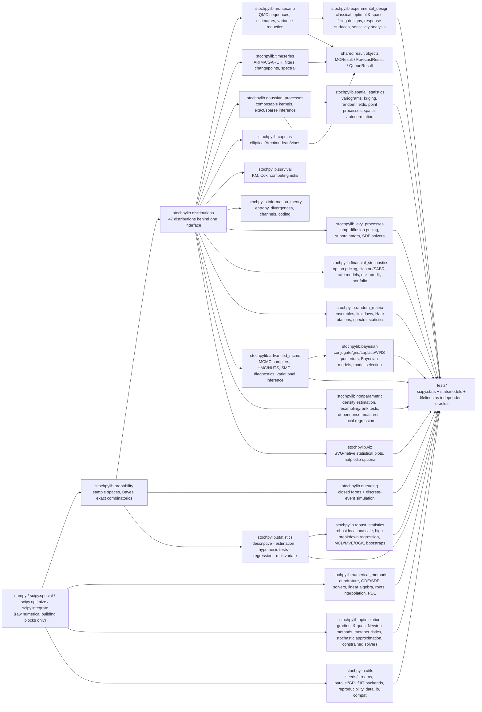

<p align="center">
  
</p>

<h1 align="center">stochpylib</h1>

<p align="center">
  <strong>Probability · Distributions · Monte Carlo — one coherent Python library, engineered to prove that a complete stochastic-computing stack can live in a single well-tested package.</strong>
</p>

<p align="center">
  
  
  
  <a href="https://github.com/leon1706-lol/Stochpylib/actions/workflows/ci.yml"></a>
  <a href="https://pypi.org/project/stochpylib/"></a>
  
</p>

<p align="center">
  
  
  
  
  
  
</p>

---

stochpylib is not a wrapper around existing statistical libraries — every distribution and
algorithm is implemented from scratch on top of `scipy.special/optimize/integrate` as raw
numerical building blocks, with `scipy.stats`, `statsmodels` and `lifelines` used only as
independent test oracles. One contract holds everywhere: every distribution exposes
`.pdf()/.cdf()/.ppf()/.rvs()/.mean()/.var()/.skewness()/.kurtosis()/.entropy()/.mgf()/.cf()/
.fit()/.ks_test()`, every stochastic method takes `random_state=`, and every Monte Carlo
estimator returns a shared result object with a point estimate, standard error and
confidence interval.

Twenty-three modules are built on that contract, covering the full design spec
(794/794 public names): probability, 47 distributions, Monte Carlo, time series, Gaussian
processes, survival analysis, queueing, copulas, information theory, Lévy processes,
financial stochastics, statistics, random matrix theory, advanced MCMC, numerical methods,
Bayesian inference, robust statistics, nonparametric methods, optimization, design of
experiments, spatial statistics, visualization and utilities (seeding, parallel/GPU/JIT
execution, reproducibility, data cleaning, serialization, interop). See
[Current Status](#current-status) for the per-module breakdown,
[Architecture](#architecture) for the structural picture, and
[Known Limitations](#known-limitations) for what's still rough at the edges.

## Known Limitations

- **PyPI lags the repository** (`0.6.4` published vs. `0.20.0` here — no tag pushed since the
  early modules). Install from source for the current code; see [Download](#download).
- **`utils`'s pandas/torch/jax/numba/cupy interop is lazy, confined to `utils/_backends.py`**,
  and never a runtime dependency; `cupy` is untested on real GPU hardware (CI fakes it).
  `n_jobs=`/`backend=` results are reproducible but not bit-identical to the legacy serial
  stream (`n_jobs=None`/`backend=None`, the defaults, are unaffected). `goodness_of_fit`
  p-values aren't corrected for estimated parameters. `queueing`'s unseeded calls no longer
  use hidden default seeds. Details: `stochpylib/utils/README.md`.
- **`viz` renders natively to SVG; matplotlib is optional**, backing only
  `.to_matplotlib()`/`.save()`. No interactivity, no 3-D, approximate SVG text metrics.
- **`statistics`'s two-sample KS p-value uses the classical asymptotic formula**, not
  scipy's finite-sample refinement (no `scipy.special` equivalent exists).
- **Multivariate distributions expose `.pdf()` (not `.pmf()`) and omit `.mgf()/.cf()`** —
  the one sanctioned interface deviation.
- **GP expectation propagation is experimental** — prefer Laplace or VI.
- **`advanced_mcmc` has no built-in autodiff** — finite differences by default;
  `utils.torch_interface`/`jax_interface` supply exact gradients when installed.
- **`numerical_methods`'s `FEniCS_Interface` solves natively by default** (FEniCS only for
  `.to_fenics()`); its BDF solver is fixed-step, 2-D elements are P1-only.
- **The full test suite is slow** (tens of minutes locally — GARCH/VARMA/vine-copula
  convergence tests); CI runs the same suite every push, so slow-but-green is normal.
- **`bayesian` has no autodiff or general-purpose PPL** — non-conjugate posteriors use a
  numerical grid, Laplace, VI, importance sampling or MCMC; `MixtureModel`/`DirichletProcess`
  cover Gaussian/1-D Poisson only; `BayesianNetwork` is discrete-only.
- **`robust_statistics`'s randomized estimators fall back to seeded subsampling** above
  5000 candidate subsets (`MCD`/`MVE`/`LTS`/`RANSAC`/etc.); `OGK` isn't affine equivariant;
  `Sn`/`Qn` estimators aren't sub-quadratic.
- **`nonparametric`'s Anderson-Darling/Cramér-von Mises p-values use asymptotic/table
  approximations**, not finite-sample corrections; local regressors are O(n) per query.
- **`optimization`'s metaheuristics (CMA-ES/DE/SA) are single-run**, with no restart
  schemes; `InteriorPoint` needs a feasible start; no autodiff means O(dim²)
  finite-difference Hessians.
- **`experimental_design`'s optimal designs are multi-start point-exchange** (local optima
  only); coverage gaps in some `BoxBehnken`/`GraecoLatin`/`Plackett_Burman` orders; plots
  are data-only with a `viz`-backed `to_figure()`.
- **`spatial_statistics` supports box observation windows only**; `CoKriging` is
  Markov-Model-1 with one secondary variable; cluster point processes fit by minimum
  contrast, not closed form.

Per-module detail for every bullet above lives in that module's own README (linked in
[Module Documentation](#module-documentation)); exact per-name spec status is in
[`development/Implementation-Checklist.md`](development/Implementation-Checklist.md).

## Table of Contents

- [Known Limitations](#known-limitations)
- [Quickstart](#quickstart)
- [Download](#download)
- [Getting Started](#getting-started)
- [Requirements](#requirements)
- [Architecture](#architecture)
- [Current Status](#current-status)
- [Project Layout](#project-layout)
- [Module Documentation](#module-documentation)
- [Development Documentation](#development-documentation)
- [Open Source Files](#open-source-files)
- [Test Suite](#test-suite)
- [CLI Reference](#cli-reference)
  - [`spl --help`](#spl---help)
  - [`spl --version`](#spl---version)
  - [`spl --test`](#spl---test)
  - [`spl update`](#spl-update)
  - [`spl info`](#spl-info)
  - [`spl show`](#spl-show)
  - [`spl demo`](#spl-demo)
  - [`spl cite`](#spl-cite)
- [Release Process](#release-process)
- [Roadmap](#roadmap)

---

## Quickstart

```python
from stochpylib.probability import bayes_theorem, total_probability

# Classic disease-screening example: 1% prevalence, 99% sensitivity, 5% false-positive rate.
p_positive = total_probability((0.99, 0.01), (0.05, 0.99))
p_disease_given_positive = bayes_theorem(0.01, 0.99, p_positive)
print(round(p_disease_given_positive, 4))  # 0.1667
```

```python
from stochpylib.distributions import Normal, Weibull
from stochpylib.montecarlo import SobolSequence, AntitheticVariates

d = Normal(0.0, 1.0)
d.pdf(0.0); d.cdf(1.96); d.ppf(0.975); d.rvs(100, random_state=0)

fitted = Weibull.fit(lifetimes)           # maximum likelihood from data
stat, p_value = fitted.ks_test(data)      # goodness of fit

pts = SobolSequence(dim=5).generate(10_000)                    # low-discrepancy points
price = AntitheticVariates(n_simulations=100_000).price_european_call(
    S=100, K=100, T=1, r=0.05, sigma=0.2)                      # option pricing
```

```python
from stochpylib.gaussian_processes import GPRegression, RBFKernel

gp = GPRegression(kernel=RBFKernel(length_scale=1.0), noise=0.01).fit(X_train, y_train)
mu, sigma = gp.predict(X_test, return_std=True)     # mean + uncertainty

from stochpylib.copulas import CopulaFit

fit = CopulaFit().fit(returns_2d)                   # dependence modeling
simulated = fit.best_.sample(10_000)                # best family by AIC
```

## Download

If you just want to *use* stochpylib rather than develop on it, no source checkout is needed:

```bash
pip install stochpylib
spl --help        # overview of everything the library offers
```

> **Note the Known Limitations above:** the published PyPI release currently lags this
> repository. For the current state of the library, install from source instead:

```bash
git clone https://github.com/leon1706-lol/Stochpylib.git
cd Stochpylib
pip install -e .
```

## Getting Started

For local development (this repo cloned, a virtual environment active):

```bash
pip install -e ".[dev]"     # runtime deps + pytest
pytest tests/ -v            # full test suite must be green before you start changing things
spl --version               # verify your editable install
spl --test                  # embedded self-check (291 checks), no pytest needed
```

Then implement or improve one module at a time and run the wrap-up procedure described in
[`CONTRIBUTING.md`](CONTRIBUTING.md).

## Requirements

- **Python ≥ 3.10**
- **NumPy** and **SciPy** (the only runtime dependencies)
- **pytest** for the development extras (`pip install -e ".[dev]"`)
- No compilers, no GPU, no other system packages — pure Python/NumPy/SciPy by design
- **matplotlib is optional** — `stochpylib.viz` renders natively to SVG with no extra
  dependency; installing matplotlib additionally unlocks `Figure.to_matplotlib()` and
  `.save('*.png'/'*.pdf')`
- **pandas/torch/jax/numba/cupy are optional** — `stochpylib.utils` needs none of them;
  each is lazily imported only when a function that needs it is called (`pip install
  "stochpylib[pandas,torch,jax,numba]"`, or `[gpu]` for cupy)

## Architecture

One subpackage per module, all built around the shared distribution contract:

- `scipy.special/optimize/integrate` supply raw numerics only.
- `probability`/`distributions` build the exact primitives and the common interface.
- Every higher-level module consumes those primitives through the same conventions:
  `random_state=` seeds, fluent `.fit()`, shared result objects (`MCResult`/
  `ForecastResult`/`QueueResult`).
- The test suite treats `scipy.stats`/`statsmodels`/`lifelines` as independent oracles —
  library code never wraps them.

#### System Flow


```mermaid
flowchart LR
    A["numpy / scipy.special / scipy.optimize / scipy.integrate<br/>(raw numerical building blocks only)"] --> B["stochpylib.probability<br/>sample spaces, Bayes, exact combinatorics"]
    B --> C["stochpylib.distributions<br/>47 distributions behind one interface"]
    C --> D["stochpylib.montecarlo<br/>QMC sequences, estimators, variance reduction"]
    C --> E["stochpylib.timeseries<br/>ARIMA/GARCH, filters, changepoints, spectral"]
    C --> F["stochpylib.gaussian_processes<br/>composable kernels, exact/sparse inference"]
    C --> G["stochpylib.copulas<br/>elliptical/Archimedean/vines"]
    C --> H["stochpylib.survival<br/>KM, Cox, competing risks"]
    B --> I["stochpylib.queueing<br/>closed forms + discrete-event simulation"]
    C --> J["stochpylib.information_theory<br/>entropy, divergences, channels, coding"]
    C --> M["stochpylib.levy_processes<br/>jump-diffusion pricing, subordinators, SDE solvers"]
    C --> N["stochpylib.financial_stochastics<br/>option pricing, Heston/SABR, rate models, risk, credit, portfolio"]
    B --> O["stochpylib.statistics<br/>descriptive · estimation · hypothesis tests · regression · multivariate"]
    C --> P["stochpylib.random_matrix<br/>ensembles, limit laws, Haar rotations, spectral statistics"]
    C --> Q["stochpylib.advanced_mcmc<br/>MCMC samplers, HMC/NUTS, SMC, diagnostics, variational inference"]
    A --> R["stochpylib.numerical_methods<br/>quadrature, ODE/SDE solvers, linear algebra, roots, interpolation, PDE"]
    Q --> S["stochpylib.bayesian<br/>conjugate/grid/Laplace/VI/IS posteriors, Bayesian models, model selection"]
    O --> T["stochpylib.robust_statistics<br/>robust location/scale, high-breakdown regression, MCD/MVE/OGK, bootstraps"]
    C --> U["stochpylib.nonparametric<br/>density estimation, resampling/rank tests, dependence measures, local regression"]
    A --> V["stochpylib.optimization<br/>gradient & quasi-Newton methods, metaheuristics, stochastic approximation, constrained solvers"]
    D --> W["stochpylib.experimental_design<br/>classical, optimal & space-filling designs, response surfaces, sensitivity analysis"]
    F --> X["stochpylib.spatial_statistics<br/>variograms, kriging, random fields, point processes, spatial autocorrelation"]
    C --> Y["stochpylib.viz<br/>SVG-native statistical plots, matplotlib optional"]
    A --> Z["stochpylib.utils<br/>seeds/streams, parallel/GPU/JIT backends, reproducibility, data, io, compat"]
    D --> K["shared result objects<br/>MCResult / ForecastResult / QueueResult"]
    E --> K
    F --> K
    K --> L["tests/<br/>scipy.stats + statsmodels + lifelines as independent oracles"]
    I --> L
    M --> L
    N --> L
    O --> L
    P --> L
    Q --> L
    R --> L
    S --> L
    T --> L
    U --> L
    V --> L
    W --> L
    X --> L
    Y --> L
    Z --> L
```

#### Tech Stack


```mermaid
flowchart TB
    A["Runtime"] --> A1["Python >= 3.10"]
    A --> A2["NumPy"]
    A --> A3["SciPy (special / optimize / integrate only)"]
    A --> A4["matplotlib (optional, lazy -- viz raster/PDF backend only)"]
    A --> A5["pandas/torch/jax/numba/cupy (optional, lazy -- utils/_backends.py only)"]
    B["Packaging"] --> B1["setuptools + pyproject.toml"]
    B --> B2["PyPI via Trusted Publisher (OIDC)"]
    B --> B3["spl console CLI (cli.py)"]
    C["Testing"] --> C1["pytest (tests/, outside the package)"]
    C --> C2["scipy.stats / statsmodels / lifelines as test oracles"]
    C --> C3["spl --test embedded self-check (291 checks)"]
    D["CI / release"] --> D1["GitHub Actions: ci.yml, publish.yml, release.yml"]
    E["Design vault"] --> E1["Stochpylib-Obsidian-Vault (private, generated code graph)"]
```

These two diagrams are the high-level summary. For the full system — the objective, the
module map, the common distribution contract, and the cross-cutting conventions every
module must follow — see
**[`development/architecture.md`](development/architecture.md)**.

## Current Status

Twenty-three modules implemented and tested — **794 / 794 spec names**:

| Module | Public names | What's inside |
|---|---|---|
| `stochpylib.probability` | 21 | Sample spaces, Bayes' theorem, exact combinatorics, independence checks |
| `stochpylib.distributions` | 60 | 47 distributions (discrete/continuous/multivariate/heavy-tailed) |
| `stochpylib.montecarlo` | 25 | QMC sequences, MC estimators, variance reduction, applications |
| `stochpylib.timeseries` | 61 | ARIMA/GARCH families, Kalman/particle filters, HMMs, spectral analysis |
| `stochpylib.gaussian_processes` | 36 | Kernel zoo, exact/sparse/approximate-classification GPs, DeepGP |
| `stochpylib.copulas` | 26 | Elliptical/Archimedean/empirical copulas, vines, dependence measures |
| `stochpylib.survival` | 28 | Kaplan-Meier, Cox regression, parametric censored fits, competing risks |
| `stochpylib.queueing` | 29 | M/M/1–Jackson networks, blocking formulas, discrete-event simulation |
| `stochpylib.information_theory` | 31 | Entropy, divergences, mutual information, channel capacity, coding |
| `stochpylib.levy_processes` | 33 | Jump-diffusion pricing, subordinators, Hawkes/branching processes, SDE solvers |
| `stochpylib.financial_stochastics` | 50 | Option pricing, stochastic/local vol, rate models, risk, credit, portfolio |
| `stochpylib.statistics` | 48 | Estimation, hypothesis tests, regression, multivariate methods |
| `stochpylib.random_matrix` | 23 | Classical ensembles, limit laws, Haar rotations, spectral statistics |
| `stochpylib.advanced_mcmc` | 35 | MH/Gibbs/HMC/NUTS/SMC samplers, diagnostics, variational inference |
| `stochpylib.numerical_methods` | 38 | Quadrature, ODE/SDE solvers, linear algebra, root finding, PDE tools |
| `stochpylib.bayesian` | 25 | Conjugate/grid/Laplace/VI posteriors, Bayesian models, model selection |
| `stochpylib.robust_statistics` | 28 | Robust location/scale, high-breakdown regression, MCD/MVE/OGK, bootstraps |
| `stochpylib.nonparametric` | 31 | Density estimation, resampling/rank tests, dependence measures, local regression |
| `stochpylib.optimization` | 32 | Gradient/quasi-Newton methods, metaheuristics, stochastic approximation, constrained solvers |
| `stochpylib.experimental_design` | 29 | Classical/optimal/space-filling designs, response surfaces, sensitivity analysis |
| `stochpylib.spatial_statistics` | 32 | Variograms, kriging, random fields, point processes, spatial autocorrelation |
| `stochpylib.viz` | 35 | SVG-native statistical plots, matplotlib optional |
| `stochpylib.utils` | 38 | Seeding, parallel/GPU/JIT backends, reproducibility, data cleaning, interop |

Exact progress against the full design spec lives in
[`development/Implementation-Checklist.md`](development/Implementation-Checklist.md)
(currently **794 / 794 public names**).

## Project Layout

The repository is a nested installable package, a test suite outside it, development
docs, and the private design-spec vault. Every folder carries its own short `README.md`
as an entry-point guide:

| Folder | Guide | What lives there |
|---|---|---|
| `stochpylib/` | [package guide](stochpylib/README.md) | the installable package: twenty-three module subpackages, `cli.py`, `selftest.py` |
| `tests/` | [suite guide](tests/README.md) | per module: an oracle suite (`tests.py`) and an end-to-end API sweep (`e2e.py`), plus the cross-module library/docs/cli suites, outside the installed package |
| `development/` | [dev-docs guide](development/README.md) | architecture, infrastructure runbook, build history, bug audit log, progress checklist |
| `.github/` | — | CI / PyPI-publish / GitHub-Release workflows, issue & PR templates |
| `Stochpylib-Obsidian-Vault/` | — | the full design-spec vault; maintained privately, not part of this repo |

## Module Documentation

Every module subpackage has its own README with the full detail on what it owns, its
conventions and its documented limitations — this table is the index:

| Module | What it owns | Docs |
|---|---|---|
| `stochpylib/probability/` | Sample spaces, Bayes, exact-integer combinatorics, independence checks | [README](stochpylib/probability/README.md) |
| `stochpylib/distributions/` | 47 distributions behind the common distribution contract | [README](stochpylib/distributions/README.md) |
| `stochpylib/montecarlo/` | Quasi-random sequences, estimators, variance reduction, applications | [README](stochpylib/montecarlo/README.md) |
| `stochpylib/timeseries/` | Linear/volatility models, filters, changepoints, spectral analysis, forecasting | [README](stochpylib/timeseries/README.md) |
| `stochpylib/gaussian_processes/` | Composable kernels, exact/sparse regression, classification, hyperparameters | [README](stochpylib/gaussian_processes/README.md) |
| `stochpylib/copulas/` | Elliptical/Archimedean/empirical copulas, vines, dependence measures | [README](stochpylib/copulas/README.md) |
| `stochpylib/survival/` | Kaplan-Meier, parametric fits, Cox/AFT/FineGray regression, competing risks | [README](stochpylib/survival/README.md) |
| `stochpylib/queueing/` | Single queues, birth-death formulas, networks, discrete-event simulation | [README](stochpylib/queueing/README.md) |
| `stochpylib/information_theory/` | Entropy, divergences, mutual information, channels, coding | [README](stochpylib/information_theory/README.md) |
| `stochpylib/levy_processes/` | Lévy-Khintchine core, jump-diffusion pricing, subordinators, advanced point/branching/field processes, SDE solvers | [README](stochpylib/levy_processes/README.md) |
| `stochpylib/financial_stochastics/` | Option pricing & Greeks, stochastic/local vol, short-rate models, risk, credit, portfolio construction | [README](stochpylib/financial_stochastics/README.md) |
| `stochpylib/statistics/` | Descriptive stats, estimation, hypothesis tests, regression, multivariate methods | [README](stochpylib/statistics/README.md) |
| `stochpylib/random_matrix/` | Classical ensembles, limiting spectral laws, Haar rotations, spectral statistics | [README](stochpylib/random_matrix/README.md) |
| `stochpylib/advanced_mcmc/` | MCMC samplers (MH to NUTS/RMHMC), slice/tempering/SMC/particle/transdimensional methods, diagnostics, variational inference | [README](stochpylib/advanced_mcmc/README.md) |
| `stochpylib/numerical_methods/` | Gauss quadrature & adaptive/cubature integration, ODE/SDE solvers, native linear algebra, root finding, interpolation, PDE tools | [README](stochpylib/numerical_methods/README.md) |
| `stochpylib/bayesian/` | Priors/likelihoods/posteriors, conjugate engine, Bayesian models, model selection, posterior approximations | [README](stochpylib/bayesian/README.md) |
| `stochpylib/robust_statistics/` | Robust location/scale, high-breakdown regression, robust covariance, resampling | [README](stochpylib/robust_statistics/README.md) |
| `stochpylib/nonparametric/` | Density estimation, empirical/likelihood, resampling & rank tests, dependence measures, local regression | [README](stochpylib/nonparametric/README.md) |
| `stochpylib/optimization/` | Gradient & quasi-Newton methods, global metaheuristics, stochastic approximation, constrained solvers | [README](stochpylib/optimization/README.md) |
| `stochpylib/experimental_design/` | Classical, optimal and space-filling designs, response surfaces & surrogates, effect and sensitivity analysis | [README](stochpylib/experimental_design/README.md) |
| `stochpylib/spatial_statistics/` | Variograms and fitting, kriging (simple/ordinary/universal/co-/indicator/disjunctive), covariance-driven random fields, point processes, spatial autocorrelation tests | [README](stochpylib/spatial_statistics/README.md) |
| `stochpylib/viz/` | SVG-native statistical plots (matplotlib optional): distribution/process/diagnostic/multivariate/special-purpose plots, all reusing the rest of the library's numbers | [README](stochpylib/viz/README.md) |
| `stochpylib/utils/` | Seeds/streams, parallel/GPU/JIT backends, reproducibility, distribution fitting & data cleaning, serialization, numpy/scipy/pandas/torch/jax interop | [README](stochpylib/utils/README.md) |

## Development Documentation

| Document | Contents |
|---|---|
| [`development/README.md`](development/README.md) | Index of this folder |
| [`development/architecture.md`](development/architecture.md) | The full system architecture: objective, diagrams, module map, the common distribution contract, cross-cutting conventions, package layout rules |
| [`development/infrastructure.md`](development/infrastructure.md) | Build/packaging/CI runbook: local setup, the `spl` CLI, GitHub Actions workflows, the PyPI release pipeline |
| [`development/project_structure.md`](development/project_structure.md) | The annotated directory tree of the repository |
| [`development/Development.md`](development/Development.md) | Layout decisions & workflow notes |
| [`development/CHANGELOG.md`](development/CHANGELOG.md) | Append-only log, one entry per build phase |
| [`development/Probleme.md`](development/Probleme.md) | Bug audit log in Problem → Fix → Verification format with a status legend |
| [`development/Implementation-Checklist.md`](development/Implementation-Checklist.md) | Every planned public name as a checkbox |
| [`todo.md`](todo.md) | **Owner's planning canvas** — the current objective(s) and personal notes for the next AI agent to pick up; not a generated backlog, expect it to be rewritten as priorities change |

## Open Source Files

| File | Purpose |
|---|---|
| [`LICENSE`](LICENSE) | MIT |
| [`CONTRIBUTING.md`](CONTRIBUTING.md) | Dev setup, ground rules, **semver & deprecation policy**, PR checklist |
| [`CODE_OF_CONDUCT.md`](CODE_OF_CONDUCT.md) | Contributor Covenant 2.1 |
| [`SECURITY.md`](SECURITY.md) | Private vulnerability reporting (72 h acknowledgment) |
| [`AGENTS.md`](AGENTS.md) | Agent/contributor guide: project conventions, verification workflow, file sync checklist |

## Test Suite

```bash
pytest tests/ -v
```

**2937 passed / 2 skipped** (the 2 skips are documented VonMises/Kumaraswamy scipy
cross-checks, covered by dedicated checks instead).

- Deterministic — fixed seeds everywhere, lives outside the installed package.
- Oracles: `scipy.stats`, `statsmodels`, brute-force references; assertions set at ≥ 3 SE.
- `tests/docs/` keeps every number on this page in sync with reality — fails on any drift.
- `tests/cli/` covers the `spl` surface with mocked PyPI responses; no test touches the network.
- Every module carries an **end-to-end API sweep** (`tests/<module>/e2e.py`) — one exercise
  per public name, guarded so a new name can't ship without one.
- CI runs one visible `smoke (<module>)` job per module (oracle suite + sweep + `spl demo`).
- `spl --test` re-verifies any installation in seconds, no pytest needed.

## CLI Reference

Every install (PyPI wheel or `pip install -e .`) registers one console command, `spl`:

### `spl --help`

- Full inventory of the installed library: modules (with public name counts), all public
  functions per module, every distribution class.
- Generated dynamically from the package's `__all__`, so it never goes stale.
- Also shows the common distribution interface and a runnable quick-start snippet.
- Bare `spl` shows the same thing.

### `spl --version`

```bash
$ spl --version
0.20.0
latest on PyPI: 0.6.4  (installed version is newer / unreleased)
```

- Prints the installed version (pip metadata, falling back to the in-code version).
- Compares against the **latest version published on PyPI** and states the relationship
  (update available / up to date / installed is newer).
- Non-blocking and offline-safe: 4-second timeout, 24h cache, a clear "PyPI check
  unavailable" message when offline.
- Disable entirely with `STOCHPYLIB_SKIP_UPDATE_CHECK=1`.

### `spl --version --list`

```bash
$ spl --version --list
0.20.0
latest on PyPI: 0.6.4  (installed version is newer / unreleased)
3 published versions:
  0.1.0
  0.1.1
  0.6.4         latest
```

- Lists **every version ever published on PyPI**, in release order.
- Installed version marked `* installed`, newest marked `latest`.
- Always fetches fresh metadata (never served from the 24h cache).

### `spl --test`

- The embedded self-check suite shipped inside the wheel (**291 checks**): package sanity,
  per-module spec conformance, one closed-form spot check per distribution family, Monte
  Carlo convergence sanity, cross-module workflows, offline CLI-helper logic.
- Works after any `pip install` — no pytest, no source checkout — the quickest way to
  verify an installation.
- Exits non-zero on any failure.

### `spl update`

```text
spl update [--vers VERSION] [--yes] [--dry-run] [--force]
```

- Switches the installed PyPI package to any published version — upgrade, downgrade, or
  pin (`spl update --vers 0.6.1`); without `--vers` it updates to the latest release.
- Validates the target against PyPI's actual release list and refuses unknown versions
  (printing the most recent published ones).
- Detects editable/source installs (`spl update` manages the *pip* package, not a source
  checkout) and refuses them without `--force`.
- Prints the exact plan — installed, target, and the precise `python -m pip install
  stochpylib==X.Y.Z` command — then asks for confirmation unless `--yes` is given.
- `--dry-run` prints the plan and executes nothing.

### `spl info`

- Environment report: stochpylib version, install mode (editable/wheel/source).
- Python and platform, NumPy/SciPy versions.
- Module inventory with per-module public-name counts.
- The quickest answer to "what exactly is installed here?"

### `spl show`

```text
spl show <Name>
```

- Prints the qualified path, constructor signature and docstring of any public name —
  `spl show Normal`, `spl show GARCH`, `spl show bayes_theorem`.
- Searches every implemented module's exports.
- Unknown names get `did you mean:` suggestions from close matches and a non-zero exit.

### `spl demo`

```text
spl demo [module]
```

A **live mini-example** for one implemented module against the real installation —
deterministic, fixed seeds, a few seconds each:

- **probability** — Bayes screening problem
- **distributions** — distribution fit + KS test
- **montecarlo** — Sobol sequence + option pricing vs. Black-Scholes
- **timeseries** — AR fit + forecast
- **gaussian_processes** — GP regression with uncertainty
- **copulas** — copula AIC selection
- **survival** — Kaplan-Meier
- **queueing** — M/M/1 closed form
- **information_theory** — entropy + Huffman coding
- **levy_processes** — Kou jump-diffusion pricing + a tempered-stable subordinator path
- **financial_stochastics** — Black-Scholes/Heston pricing + historical VaR
- **statistics** — descriptive stats + t-test + OLS regression + PCA
- **random_matrix** — GOE spectrum vs. the semicircle + Marchenko-Pastur + level repulsion
- **advanced_mcmc** — NUTS on a correlated Gaussian (R-hat/ESS) + slice sampling + SMC evidence
- **numerical_methods** — Gauss-Legendre quadrature + Dormand-Prince energy conservation +
  Brent implied vol + Crank-Nicolson PDE price + a CTMC transition-matrix exponential
- **bayesian** — conjugate coin-flip posterior + Bayesian linear regression (WAIC) +
  a Bayes factor + a Bayesian-network query
- **robust_statistics** — contaminated-sample comparison + Theil-Sen/MM vs. OLS under
  outliers + MCD outlier flags + a block-bootstrap SE
- **nonparametric** — bimodal KDE fit + Kruskal-Wallis + distance correlation +
  local-linear R² + an isotonic-regression check
- **optimization** — BFGS on Rosenbrock + particle swarm/CMA-ES on Rastrigin-5 +
  Levenberg-Marquardt + an augmented-Lagrangian solve
- **experimental_design** — a 2^(5-1) fraction's alias structure + Lenth's method +
  a D-optimal design + a CCD stationary point + Ishigami Sobol indices + a maximin LHS
- **spatial_statistics** — a fitted variogram + ordinary kriging + Moran's I +
  a Ripley-K CSR verdict + a Thomas cluster process
- **viz** — a QQ-plot + AR(1) ACF + Kaplan-Meier median (+ matplotlib availability check)
- **utils** — `set_seed()` reproducibility + AIC-ranked fit + parallel pi estimate +
  a benchmark timing + backend availability report

Bare `spl demo` lists the available demos.

### `spl cite`

- Plain-text citation plus a ready-to-paste BibTeX entry.
- Versioned with the installed release.

## Release Process

Releases are fully automated from tags:

1. Update the version in `pyproject.toml` **and** `stochpylib/__init__.py` (semver — see the
   policy in [`CONTRIBUTING.md`](CONTRIBUTING.md))
2. Tag and push:
   ```bash
   git tag vX.Y.Z && git push origin vX.Y.Z
   ```
3. CI runs the full test matrix, builds sdist + wheel, smoke-verifies the wheel
   (`spl --version`, `spl --test`) and publishes to PyPI via Trusted Publisher (OIDC — no API
   tokens stored anywhere); a second workflow creates the matching GitHub Release with
   auto-generated changelog notes

Prerequisite for step 3: configure the Trusted Publisher once under pypi.org → your project →
Publishing.

## Roadmap

All 23 modules of the design spec are implemented (794/794 public names). Ongoing work:

- Close the documented [Known Limitations](#known-limitations) above.
- Whatever [`todo.md`](todo.md) sets as the next objective.

Full history: [`development/CHANGELOG.md`](development/CHANGELOG.md).

---

<p align="center">
  Built by <strong>Leon Schwarzkopf</strong>, <a href="mailto:leonschwarzkopf08@gmail.com">leonschwarzkopf08@gmail.com</a>
</p>

---

<div align="center">
  <sub>stochpylib</sub>
</div>
