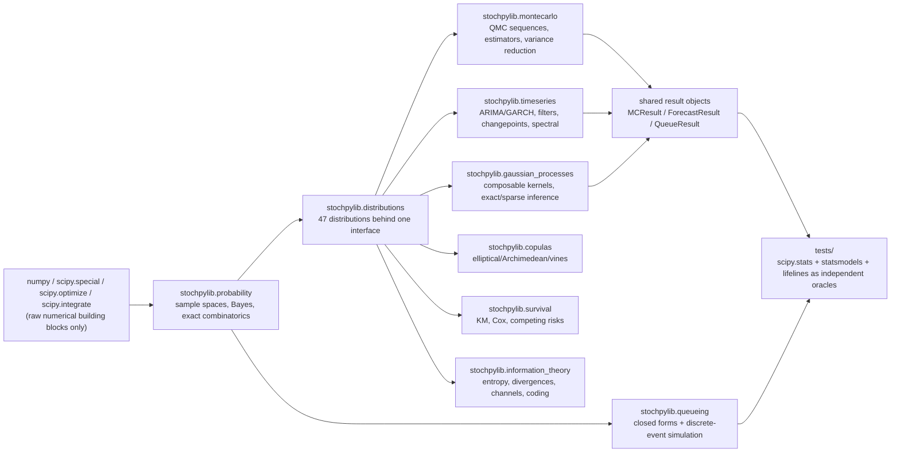
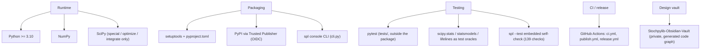

# stochpylib Architecture

**Status:** nine of 23 planned modules are implemented and tested (317/794
public names — see [`Implementation-Checklist.md`](Implementation-Checklist.md)
for the authoritative per-name state). Everything else in the module map below
remains design spec, not shipped code.

**How to read this document:** read top to bottom. The objective and the two
diagrams give the whole picture; the contract sections describe what every
shipped module owns and the cross-cutting conventions that bind them. History
(what was built when, what broke) lives in [`CHANGELOG.md`](CHANGELOG.md) and
[`Probleme.md`](Probleme.md); this document describes only the current state.

## Objective

stochpylib's thesis: a complete stochastic-computing stack — from combinatorics
and Bayes' theorem up through Levy processes, random matrix theory and MCMC —
can live in one coherent, well-tested Python package, so a user never has to
stitch together `scipy.stats` + `statsmodels` + `pymc` + `arch` + `lifelines` +
`copulas` separately. The load-bearing idea making that scale is a **single
common contract**: every distribution exposes the same method set, every
stochastic method takes `random_state=`, every estimator returns a shared
result-object shape. Everything shipped so far exists to prove that contract
holds under real numerical load, with native implementations and honest
standard errors throughout.

## System Flow

## Tech Stack

## Module Map

Shipped modules (each `stochpylib/<module>/`, flat submodule files inside, one
README per module):

- `probability/` — sample spaces, events, Bayes, exact-integer combinatorics,
  independence checks. Plain functions; no base class.
- `distributions/` — 47 classes across discrete/continuous/multivariate/
  heavy-tailed families behind the common interface (`_base.py` holds the
  fallback machinery; closed forms override per class).
- `montecarlo/` — Sobol/Halton/Faure/Niederreiter sequences, crude/QMC/
  importance/rejection/stratified estimators, variance reduction, applications
  (Black–Scholes-validated option pricing, VaR/ES, reliability on library
  distribution objects).
- `timeseries/` — ARIMA family, GARCH family (Gaussian QMLE), Kalman/EKF/UKF/
  particle filters, HMMs, changepoints, spectral analysis, diagnostics,
  forecasting.
- `gaussian_processes/` — 10-kernel composable zoo, exact inference, whitened
  FITC/VFE sparse engines, Laplace/EP/VI classification, hyperparameter
  optimization.
- `copulas/` — elliptical (exact recursive-integration CDF), Archimedean
  generators with tau-inversion fits and Marshall–Olkin samplers, empirical
  families, C-/D-/R-vines with AIC pair selection, `CopulaFit` dispatcher.
- `survival/` — Kaplan-Meier/Nelson-Aalen/life tables, parametric censored
  MLEs, Cox PH (Breslow/Efron), stratified/AFT/additive/FineGray regression,
  log-rank family, Aalen-Johansen competing risks.
- `queueing/` — M/M/1 to M/G/1 priority closed forms, birth-death formulas
  (Erlang B/C, Engset), Jackson/closed/BCMP networks, `DiscreteEventSim`.
- `information_theory/` — entropy families, divergences, mutual-information
  quantities, channel capacities, transfer entropy, Huffman coding, AEP.

Planned modules (14, in rough implementation order): levy_processes,
financial_stochastics, advanced_mcmc, bayesian, statistics, nonparametric,
robust_statistics, numerical_methods, random_matrix, spatial_statistics,
optimization, experimental_design, viz, utils — each lands with the same bar:
native implementations, the shared conventions, full tests against independent
oracles, honest documentation of deviations.

## The Common Distribution Contract

Every class in `stochpylib/distributions/` exposes the same 13-method surface —
`.pdf()/.pmf()`, `.cdf()`, `.ppf()`, `.rvs()`, `.mean()`, `.var()`,
`.skewness()`, `.kurtosis()`, `.entropy()`, `.mgf()`, `.cf()`, `.fit()`,
`.ks_test()` — because the rest of the library (Monte Carlo applications,
survival wrappers, future plotting) is built against this surface, not against
individual classes. The one sanctioned deviation: the 7 multivariate classes
expose `.pdf()` instead of `.pmf()` and omit scalar-argument `.mgf()/.cf()`,
asserted as such in `tests/library/tests.py`. Generic numerical fallbacks in
`_base.py` guarantee the surface exists for every class; closed forms override
where they exist and are cross-checked against `scipy.stats` as the test oracle.

## Cross-Cutting Conventions (established by shipped modules)

- **Seeds**: every stochastic method takes `random_state=None` (anything
  `np.random.default_rng` accepts) — never a bare global seed.
- **Result objects**: Monte Carlo estimators return `MCResult` (`.estimate`,
  `.std_error`, `.confidence_interval()`); specialized results subclass it
  (`RiskResult` adds expected shortfall). Forecasting returns `ForecastResult`
  (`.mean`, `.std`, `.confidence_interval(level)`); queueing models return the
  immutable `QueueResult` (`L`, `Lq`, `W`, `Wq`, `rho`). New estimator-shaped
  APIs must follow the same shape — a point estimate is never shipped without
  its uncertainty.
- **Fluent fit**: model classes take orders/hyperparameters in the constructor
  (`ARIMA(p, d, q)`), `.fit(data)` returns self, fitted parameters live on the
  instance as attributes ending in `_`, query methods come afterwards.
- **Streams vs resets**: low-discrepancy sequences advance on successive
  `generate(n)` calls; `reset()` restarts from the origin.
- **scipy policy**: no `scipy.stats` distribution objects inside library code;
  `scipy.special/optimize/integrate` are raw numerical building blocks;
  `scipy.stats`, `statsmodels` and `lifelines` are test oracles only — dev
  extras, never runtime dependencies.
- **Kernel composability**: GP kernels support algebraic composition
  (`RBFKernel(...) + MaternKernel(...)`) with flattened `part<i>__<name>`
  parameter trees for optimizers; sparse engines solve only in the whitened
  parameterization through jittered Cholesky factors — no raw inverses of
  near-singular kernel matrices.
- **Diagnostics live next to the algorithm they check**: `timeseries.tests`
  (ADF, KPSS, Ljung-Box) sits inside time series; MCMC diagnostics will sit
  inside `advanced_mcmc` — no centralized hypothesis-test module unless the
  test is genuinely general-purpose.
- **Test critical values**: published tables where rock-solid and tiny (KPSS);
  otherwise a cached seeded Monte Carlo of the null distribution (ADF/PP/
  Johansen) — deterministic, provenance-documented, no folklore constants.

## Package Layout Convention

Each module in the map is one `stochpylib/<module>/` package with flat sibling
submodule files (`stochpylib/timeseries/volatility_models.py` holds the GARCH
family); an `_base.py` appears only when real shared base-class behavior exists.
Spec examples import from the top level (`from stochpylib.timeseries import
GARCH, ARIMA`), so submodule names stay implementation detail re-exported at
the module `__init__.py`. Tests live outside the package entirely
(`tests/<module>/tests.py`) so nothing test-only ships in the wheel.

## Known Gaps (from the design scorecard)

The two lowest-scored areas as currently specced (see the vault's
`Ratings.md`): spatial statistics (8/10 — no CAR/SAR models) and Bayesian
inference (9/10 — variational inference thin relative to its computation
section). When those modules get implemented, treat these as first follow-ups
rather than re-deriving scope.
