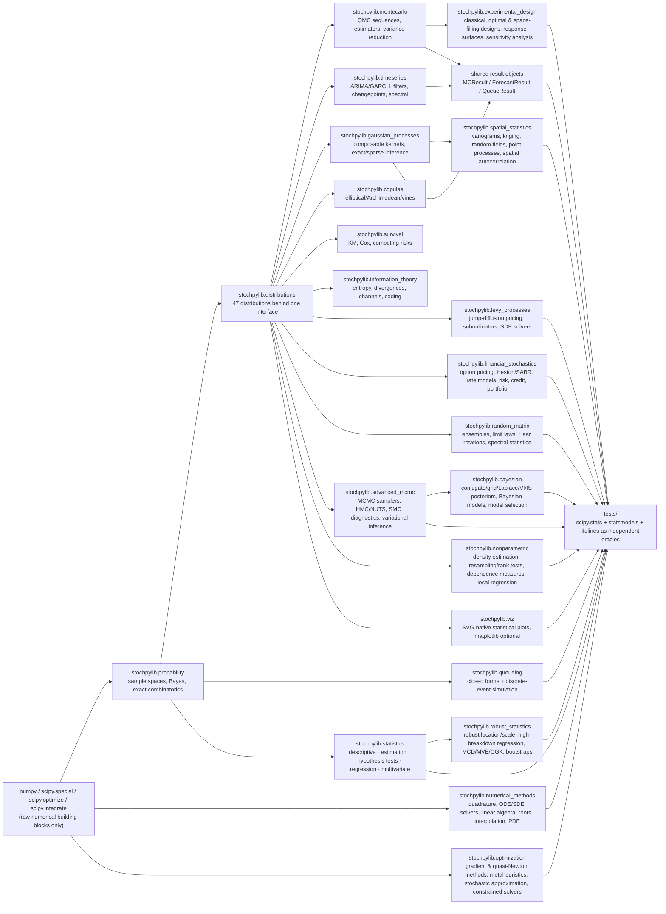

# stochpylib Architecture

**Status:** twenty-two of 23 planned modules are implemented and tested (756/794
public names — see [`Implementation-Checklist.md`](Implementation-Checklist.md)
for the authoritative per-name state). Everything else in the module map below
remains design spec, not shipped code.

**How to read this document:** read top to bottom. The objective and the two
diagrams give the whole picture; the contract sections describe what every
shipped module owns and the cross-cutting conventions that bind them. History
(what was built when, what broke) lives in [`CHANGELOG.md`](CHANGELOG.md) and
[`Probleme.md`](Probleme.md); this document describes only the current state.

## Objective

stochpylib's thesis: a complete stochastic-computing stack — from combinatorics
and Bayes' theorem up through Levy processes, random matrix theory and MCMC —
can live in one coherent, well-tested Python package, so a user never has to
stitch together `scipy.stats` + `statsmodels` + `pymc` + `arch` + `lifelines` +
`copulas` separately. The load-bearing idea making that scale is a **single
common contract**: every distribution exposes the same method set, every
stochastic method takes `random_state=`, every estimator returns a shared
result-object shape. Everything shipped so far exists to prove that contract
holds under real numerical load, with native implementations and honest
standard errors throughout.

## System Flow

## Tech Stack

```mermaid
flowchart TB
    A["Runtime"] --> A1["Python >= 3.10"]
    A --> A2["NumPy"]
    A --> A3["SciPy (special / optimize / integrate only)"]
    A --> A4["matplotlib (optional, lazy -- viz raster/PDF backend only)"]
    B["Packaging"] --> B1["setuptools + pyproject.toml"]
    B --> B2["PyPI via Trusted Publisher (OIDC)"]
    B --> B3["spl console CLI (cli.py)"]
    C["Testing"] --> C1["pytest (tests/, outside the package)"]
    C --> C2["scipy.stats / statsmodels / lifelines as test oracles"]
    C --> C3["spl --test embedded self-check (275 checks)"]
    D["CI / release"] --> D1["GitHub Actions: ci.yml, publish.yml, release.yml"]
    E["Design vault"] --> E1["Stochpylib-Obsidian-Vault (private, generated code graph)"]
```

## Module Map

Shipped modules (each `stochpylib/<module>/`, flat submodule files inside, one
README per module):

- `probability/` — sample spaces, events, Bayes, exact-integer combinatorics,
  independence checks. Plain functions; no base class.
- `distributions/` — 47 classes across discrete/continuous/multivariate/
  heavy-tailed families behind the common interface (`_base.py` holds the
  fallback machinery; closed forms override per class).
- `montecarlo/` — Sobol/Halton/Faure/Niederreiter sequences, crude/QMC/
  importance/rejection/stratified estimators, variance reduction, applications
  (Black–Scholes-validated option pricing, VaR/ES, reliability on library
  distribution objects).
- `timeseries/` — ARIMA family, GARCH family (Gaussian QMLE), Kalman/EKF/UKF/
  particle filters, HMMs, changepoints, spectral analysis, diagnostics,
  forecasting.
- `gaussian_processes/` — 10-kernel composable zoo, exact inference, whitened
  FITC/VFE sparse engines, Laplace/EP/VI classification, hyperparameter
  optimization.
- `copulas/` — elliptical (exact recursive-integration CDF), Archimedean
  generators with tau-inversion fits and Marshall–Olkin samplers, empirical
  families, C-/D-/R-vines with AIC pair selection, `CopulaFit` dispatcher.
- `survival/` — Kaplan-Meier/Nelson-Aalen/life tables, parametric censored
  MLEs, Cox PH (Breslow/Efron), stratified/AFT/additive/FineGray regression,
  log-rank family, Aalen-Johansen competing risks.
- `queueing/` — M/M/1 to M/G/1 priority closed forms, birth-death formulas
  (Erlang B/C, Engset), Jackson/closed/BCMP networks, `DiscreteEventSim`.
- `information_theory/` — entropy families, divergences, mutual-information
  quantities, channel capacities, transfer entropy, Huffman coding, AEP.
- `levy_processes/` — Lévy-Khintchine core (stable processes, subordination),
  jump-diffusion pricing (Merton/Kou/Bates/Variance-Gamma/CGMY/NIG via
  Carr-Madan Fourier inversion), subordinators (gamma/inverse-Gaussian/
  stable/tempered-stable), Hawkes (exact recursive MLE + time-rescaling KS
  residuals)/Cox/renewal/branching/semi-Markov processes, Gaussian random
  fields, SDE solvers (Euler-Maruyama through strong order 1.5 Taylor, weak
  order 2 Talay-Tubaro).
- `financial_stochastics/` — option pricing (Black-Scholes/trees/Monte
  Carlo/Longstaff-Schwartz/Carr-Madan & COS Fourier inversion) & Greeks
  (closed-form + finite-difference + pathwise/likelihood-ratio Monte Carlo),
  stochastic/local volatility (Heston "little trap" cf with QE simulation,
  SABR, fractional-Adams rough Heston, exact-Cholesky rough Bergomi, Dupire
  local vol, histogram-calibrated LVSV, variance swaps), short-rate models
  (Vasicek/CIR/Hull-White/Ho-Lee/G2++/Black-Karasinski/LMM/HJM), risk
  (historical/parametric/Cornish-Fisher VaR, ES, Rockafellar-Uryasev CVaR
  optimization, stress/scenario analysis), credit (hazard-curve CDS pricing,
  Merton structural PD, rating-migration generator, independent and
  copula-dependent portfolio loss), portfolio construction (Ledoit-Wolf
  shrinkage, mean-variance, Black-Litterman, Spinu risk parity).
- `statistics/` — descriptive stats, MLE/MOM/Bayesian-conjugate/bootstrap
  (BCa)/jackknife/delta-method/profile-likelihood estimation, z/t/chi2/F
  tests, one-way and Welch/Type-II-two-way ANOVA, MANOVA (Wilks/Pillai/
  Hotelling-Lawley/Roy), exact-DP Mann-Whitney/Wilcoxon, a from-scratch
  studentized-range CDF (Tukey HSD), Shapiro-Wilk (AS R94), OLS/WLS (HC0-HC3)
  and IRLS GLM (6 families x 8 links) regression, ridge/lasso/elastic-net,
  exact-LP quantile regression, PCA, ML/PA factor analysis, canonical
  correlation, LDA/QDA, k-means/hierarchical clustering, classical/SMACOF MDS.
- `random_matrix/` — GOE/GUE/GSE (quaternion self-dual GSE), Wigner matrices over
  any library distribution, Wishart/inverse-Wishart via the library distributions,
  CUE, a Ginibre-type i.i.d. ensemble (`MuresanMatrix`, circular law); Wigner
  semicircle, Marchenko-Pastur and Tracy-Widom (Painleve II, beta = 1/2/4) as full
  `Distribution` subclasses; Dumitriu-Edelman beta-Hermite/Laguerre and Jacobi
  ensembles; Haar O(n)/U(n)/Sp(n); spacing statistics (unfolding-free gap ratio,
  MLE level repulsion), empirical spectra, Tracy-Widom edge scaling
  (Ramirez-Rider-Virag / Johnstone-Ma), Dyson-Mehta number variance, Edelman's
  hard-edge law.
- `advanced_mcmc/` — Metropolis-Hastings/independence/Gibbs (exact conditionals
  or Metropolis-within-Gibbs), Haario adaptive Metropolis, Vihola RAM; HMC and
  NUTS (multinomial trajectories, dual averaging, windowed diagonal mass
  adaptation), MALA, simplified manifold MALA and Riemannian HMC (SoftAbs
  default metric, generalized leapfrog), NeuTra HMC through a planar flow;
  stepping/doubling slice sampling, elliptical slice sampling, Gibbsian polar
  slice sampler; replica exchange / parallel tempering with ladder adaptation,
  adaptive-tempering SMC with evidence estimates, particle marginal MH on the
  library particle filter, Green reversible-jump and Carlin-Chib product-space
  samplers; split/rank R-hat, Stan-style ESS, Gelman-Rubin/multivariate PSRF,
  Geweke, Raftery-Lewis, autocorrelation time, `TraceAnalysis`; mean-field VI,
  ADVI (support transforms, full rank), black-box VI, planar normalizing flows
  with hand-derived gradients, SVGD.
- `numerical_methods/` — Gauss-Legendre/Hermite/Chebyshev quadrature via
  Golub-Welsch, adaptive Gauss-Kronrod/Simpson, Romberg, tensor/Smolyak
  cubature; Euler/RK4/embedded Dormand-Prince/Adams-Bashforth-Moulton/implicit
  BDF ODE solvers, Euler-Maruyama/Milstein SDE paths; native Pade matrix
  exponential/logarithm, Cholesky, Jacobi/QR eigendecomposition, one-sided-
  Jacobi SVD, Householder/Gram-Schmidt/Givens QR, Francis-shift real and
  complex Schur; bisection/Brent/secant/Newton/fixed-point root finding;
  natural/clamped/not-a-knot splines, PCHIP cubic Hermite, barycentric
  Lagrange, Chebyshev series, NURBS; finite-difference/finite-element/
  boundary-element/spectral PDE solvers plus a FEniCS-style adapter that
  solves natively by default and only lazily imports a real FEniCS install.
- `bayesian/` — priors/likelihoods (ten built-in exponential families) with
  conjugate posteriors/predictives/evidence in closed form, `posterior()`/
  `evidence()` falling back to a numerical grid (dim <= 2), Laplace, VI (via
  `advanced_mcmc.MeanFieldVI`/`ADVI`), importance sampling, SMC, or MCMC (via
  `advanced_mcmc` samplers); expectation propagation (Gauss-Hermite moment
  matching, via `numerical_methods.GaussHermite`); Bayesian linear/logistic
  regression, naive Bayes, a hierarchical normal model, finite mixtures,
  discrete Bayesian networks (exact variable elimination), Dirichlet-process
  mixtures; AIC/BIC/DIC/WAIC/PSIS-LOO/TIC and Bayes factors.
- `robust_statistics/` — trimmed/winsorized means, median (Maritz-Jarrett SE,
  order-statistic CI), Hodges-Lehmann, L/M/R-estimators (M matches
  `statsmodels.RLM` exactly); MAD/Qn/Sn/IQR scales (Qn matches
  `statsmodels.robust.scale.qn_scale` exactly), biweight/tau/Huber M-scales;
  Theil-Sen (Sen 1968 CI, matches `scipy.stats.theilslopes` exactly), Siegel
  repeated medians (matches `scipy.stats.siegelslopes` exactly), RANSAC,
  FAST-LTS, FAST-S+MM, Huber regression (matches `statsmodels.RLM` exactly);
  FAST-MCD/MVE (exact subset enumeration below 5000 subsets, else seeded
  resampling with concentration/volume-shrinking steps), OGK
  (Gnanadesikan-Kettenring pairwise orthogonalization), robust correlation
  (Spearman/Kendall reuse `copulas._utils`, Gaussian-rank, quadrant); Ledoit-
  Wolf/OAS/constant-correlation shrinkage (identity-target Ledoit-Wolf matches
  `financial_stochastics.CovarianceEstimation` exactly); robust/wild/moving-
  circular-nonoverlapping-block/stationary bootstraps.
- `nonparametric/` — kernel/adaptive/kNN/orthogonal-series/log-spline density estimation
  (full 13-method distribution contract via `NonparametricDensity(Distribution)`),
  empirical distribution/CDF/characteristic-function estimators, Glivenko-Cantelli bounds,
  Owen's empirical likelihood, permutation/bootstrap/Mood/Kruskal-Wallis/Friedman/sign/runs/
  Anderson-Darling/Cramer-von Mises tests, Spearman/Kendall/distance/Hoeffding dependence
  measures, local-polynomial/isotonic/spline/quantile regression.
- `optimization/` — line-searched gradient descent and the adaptive-step family
  (AdaGrad/RMSProp/Adadelta/Adam/NADAM/AMSGrad, each matching its published update rule);
  damped Newton with a modified-Cholesky safeguard, BFGS (inverse-Hessian form, reusable
  as an asymptotic covariance), L-BFGS two-loop recursion, Fletcher-Reeves/PR+ conjugate
  gradient, dogleg/Steihaug trust region, Marquardt-scaled Levenberg-Marquardt for
  nonlinear least squares; simulated annealing (auto-calibrated temperature, best-point
  restarts), real-coded GA, particle swarm, differential evolution, ant-colony TSP,
  CMA-ES, and Bayesian optimization over a `gaussian_processes.GPRegression` Matern
  surrogate seeded by `montecarlo.LatinHypercubeSampling`; Robbins-Monro/Kiefer-Wolfowitz/
  SPSA stochastic approximation with Polyak-Ruppert averaging, the cross-entropy method,
  and sample-average approximation reporting its optimality gap as a `montecarlo.MCResult`;
  penalty, augmented-Lagrangian, Lagrangian-relaxation (dual bound), active-set QP and
  relaxed-log-barrier interior-point constrained solvers.
- `experimental_design/` — full factorials in Yates order and regular fractions (explicit
  generators or a maximum-resolution/minimum-aberration search, defining relation, alias
  structure, fold-over), Plackett-Burman from Sylvester/Paley Hadamard matrices over GF(q),
  rotatable/orthogonal/face/inscribed central composite and Box-Behnken designs, Latin and
  Graeco-Latin squares (MOLS via GF(q) and Kronecker products) with their ANOVA; D/A/G/I/T-
  and (pseudo-)Bayesian optimal designs from one multi-start point-exchange engine; Latin
  hypercube (via `montecarlo.LatinHypercubeSampling`), Morris-Mitchell maximin, minimax,
  good-lattice-point uniform and Bush orthogonal-array / Tang OA-LHS designs;
  second-order response surfaces through `statistics.linear_regression` with canonical
  analysis and `optimization.DifferentialEvolution` box optimization, lack-of-fit RSM
  ANOVA, polynomial chaos (Legendre/Hermite, `numerical_methods` Gauss rules, analytic
  Sobol indices), universal kriging on `gaussian_processes` kernels with EI sequential
  design, CV surrogate selection; contrast/Type II DOE ANOVA, main effects, interaction and
  Lenth normal-plot data, Morris/SRC/PRCC screening and Saltelli/Jansen Sobol indices as
  `montecarlo.MCResult`s.
- `spatial_statistics/` — variogram models (spherical/exponential/gaussian/general-nu-Matern
  via `scipy.special.kv`/cubic/linear/power/nugget, nested via `+`) and their fitting
  (Matheron/Cressie-Hawkins/Dowd estimators, weighted least squares or best-of-several by
  AIC); simple/ordinary/universal kriging sharing one gamma-Lagrange linear system,
  co-kriging by the Markov Model 1 simplification, indicator kriging with the
  order-relation correction, disjunctive kriging via a Hermite expansion of the Gaussian
  anamorphosis (`numerical_methods.GaussHermite`); covariance-driven Gaussian random
  fields (exact Cholesky/circulant embedding, or `method="spectral"` delegating to
  `levy_processes.GaussianRandomField`), general-nu Matern fields, per-axis-exact
  Ornstein-Uhlenbeck fields, Brownian/fractional-Brownian sheets; Poisson/inhomogeneous-
  Poisson/Thomas/Matern-cluster/log-Gaussian-Cox point processes fit by Diggle
  minimum-contrast on Ripley's K; Moran's I/Geary's C/Getis-Ord/Clark-Evans spatial
  autocorrelation tests; `SARModel`/`CARModel` lattice-model extras.
- `viz/` — SVG-native statistical plots (`_figure.py`'s scene graph + `_svg.py`'s
  from-scratch renderer; matplotlib is an optional, lazily-imported backend confined to
  `_mpl.py`). Every `plot_*()` reuses the owning module's own computation (distributions'
  ppf-based grid, timeseries' spectral functions, advanced_mcmc's Rhat/ESS,
  spatial_statistics' variograms, random_matrix's limit laws, ...) rather than re-deriving
  it; `experimental_design.InteractionPlot`/`NormalPlot` and spatial_statistics's
  variogram/covariance/summary-function classes gained a `to_figure()` hook for this.

Planned modules (1): utils — lands with the same bar:
native implementations, the shared conventions, full tests against independent
oracles, honest documentation of deviations.

## The Common Distribution Contract

Every class in `stochpylib/distributions/` exposes the same 13-method surface —
`.pdf()/.pmf()`, `.cdf()`, `.ppf()`, `.rvs()`, `.mean()`, `.var()`,
`.skewness()`, `.kurtosis()`, `.entropy()`, `.mgf()`, `.cf()`, `.fit()`,
`.ks_test()` — because the rest of the library (Monte Carlo applications,
survival wrappers, `viz.plot_pdf`/`plot_qqplot`/etc.) is built against this surface, not
against individual classes. The one sanctioned deviation: the 7 multivariate classes
expose `.pdf()` instead of `.pmf()` and omit scalar-argument `.mgf()/.cf()`,
asserted as such in `tests/library/tests.py`. Generic numerical fallbacks in
`_base.py` guarantee the surface exists for every class; closed forms override
where they exist and are cross-checked against `scipy.stats` as the test oracle.

## Cross-Cutting Conventions (established by shipped modules)

- **Seeds**: every stochastic method takes `random_state=None` (anything
  `np.random.default_rng` accepts) — never a bare global seed.
- **Result objects**: Monte Carlo estimators return `MCResult` (`.estimate`,
  `.std_error`, `.confidence_interval()`); specialized results subclass it
  (`RiskResult` adds expected shortfall). Forecasting returns `ForecastResult`
  (`.mean`, `.std`, `.confidence_interval(level)`); queueing models return the
  immutable `QueueResult` (`L`, `Lq`, `W`, `Wq`, `rho`). New estimator-shaped
  APIs must follow the same shape — a point estimate is never shipped without
  its uncertainty.
- **Fluent fit**: model classes take orders/hyperparameters in the constructor
  (`ARIMA(p, d, q)`), `.fit(data)` returns self, fitted parameters live on the
  instance as attributes ending in `_`, query methods come afterwards.
- **Streams vs resets**: low-discrepancy sequences advance on successive
  `generate(n)` calls; `reset()` restarts from the origin.
- **scipy policy**: no `scipy.stats` distribution objects inside library code;
  `scipy.special/optimize/integrate` are raw numerical building blocks;
  `scipy.stats`, `statsmodels` and `lifelines` are test oracles only — dev
  extras, never runtime dependencies. `matplotlib` follows the same never-a-hard-
  dependency spirit for `viz`: lazily imported, confined to one file
  (`viz/_mpl.py`), only inside function bodies — an AST guard enforces both.
- **Kernel composability**: GP kernels support algebraic composition
  (`RBFKernel(...) + MaternKernel(...)`) with flattened `part<i>__<name>`
  parameter trees for optimizers; sparse engines solve only in the whitened
  parameterization through jittered Cholesky factors — no raw inverses of
  near-singular kernel matrices.
- **Diagnostics live next to the algorithm they check**: `timeseries.tests`
  (ADF, KPSS, Ljung-Box) sits inside time series; MCMC diagnostics sit
  inside `advanced_mcmc.diagnostics` — no centralized hypothesis-test module
  unless the test is genuinely general-purpose.
- **MCMC conventions** (established by `advanced_mcmc`): chains are
  `(n_chains, n_samples, dim)`, `sample(theta_init, random_state=)` is fluent
  and discards warmup, adaptation freezes after warmup, gradients are optional
  callables with a finite-difference fallback, and diagnostics accept raw
  arrays so any sampler (or SMC particle cloud) can be checked.
- **Test critical values**: published tables where rock-solid and tiny (KPSS);
  otherwise a cached seeded Monte Carlo of the null distribution (ADF/PP/
  Johansen) — deterministic, provenance-documented, no folklore constants.
- **Numerical conventions** (established by `numerical_methods`): integrands/
  functions are scalar callables by default (`vectorized=True` opts into
  array-in/array-out for speed); quadrature returns `QuadratureResult` (value +
  error estimate + `converged`), root finders `RootResult`, ODE solvers
  `ODESolution` with callable dense output, SDE solvers `SDESolution`;
  matrix-decomposition classes are fluent `.compute()` objects with `_`-suffixed
  attributes; every algorithm is implemented natively, with `numpy.linalg` as an
  explicit `method="numpy"` fast path where offered —
  `scipy.integrate/optimize/interpolate/linalg` remain test oracles only.
- **Every public name is exercised end to end**: each module ships
  `tests/<module>/e2e.py` — one realistic exercise per name in `__all__`, run as
  its own pytest case, with a guard that fails when a name has no exercise. A
  module is not done until both `tests.py` (oracles) and `e2e.py` exist.
- **Bayesian conventions** (established by `bayesian`): posteriors/posterior
  approximations/model-selection criteria return the shared `Posterior` /
  `PosteriorApproximation` / `ICResult` objects (`float(ICResult)` coerces to
  the criterion value); `posterior()`/`evidence()` default to `method="auto"`
  (conjugate when the prior/likelihood pair matches, else a grid for dim <= 2,
  else Laplace/MCMC); MCMC, variational inference and SMC delegate to
  `advanced_mcmc` rather than reimplementing them, and EP's per-site moment
  matching delegates to `numerical_methods.GaussHermite`.
- **Robust-statistics conventions** (established by `robust_statistics`):
  location/scale estimators and regressors reuse `statistics.EstimateResult`/
  `RegressionResult` rather than new result types; `coef_` is intercept-first;
  randomized estimators (`MCD`/`MVE`/`LTS_Regression`/`MMRegression`/
  `RANSACRegression`, multi-predictor `TheilSenRegression`) enumerate subsets
  exactly below 5000 and fall back to seeded resampling above it; scale
  estimators report the sigma-consistent value by default (`normal=True`).
- **Nonparametric conventions** (established by `nonparametric`): density
  estimators subclass `distributions.Distribution` via `NonparametricDensity`
  and get the full 13-method contract, with `fit(x)` as a fluent instance
  method (the one documented deviation from `Distribution.fit`'s classmethod
  contract — these estimators carry bandwidth/kernel state); hypothesis tests
  and dependence measures reuse `statistics.TestResult`/`EstimateResult`
  rather than new result types; kernel-weighted local regressors drop points
  below a relative-weight threshold to keep per-query cost bounded (exact for
  a huge bandwidth, where nothing falls below threshold).
- **Optimization conventions** (established by `optimization`): every optimizer
  subclasses `Optimizer` and is driven by `minimize(fun, x0)` returning `self`
  (the `fit`-returns-self shape), with `result_` a single `OptimizeResult`;
  objectives are wrapped in `Objective`, which supplies finite-difference
  gradients/Hessians and maps NaN/`-inf` to `+inf` so an invalid point is never
  accepted; a run that exhausts its budget, stalls or diverges returns
  `converged=False` with a message rather than raising, and only genuine usage
  errors raise; Monte Carlo quantities inside a result (`SAA.gap_`, `CEM`'s
  elite estimate) are `montecarlo.MCResult`, never a new result type.
- **Experimental-design conventions** (established by `experimental_design`): every
  design class subclasses `DesignGenerator` and `generate()` returns a `Design` — the run
  matrix in coded `[-1, 1]` (classical/optimal) or unit-cube `[0, 1]` (space-filling)
  units with factor names (skipping `I`), bounds for `to_natural()` and a `properties`
  dict; `Design` is the one new result type, because a design is not an estimate.
  Surrogates subclass `MetaModel` and analyses `fit(...)` returning `self`, reusing
  `statistics.TestResult`/`RegressionResult` and `montecarlo.MCResult` (Sobol indices);
  Latin hypercubes, OLS, kernels, Gauss rules and box optimization are delegated to
  `montecarlo`/`statistics`/`gaussian_processes`/`numerical_methods`/`optimization`.
- **Spatial-statistics conventions** (established by `spatial_statistics`): kriging
  predictions reuse `timeseries.ForecastResult` and spatial tests reuse
  `statistics.TestResult`, so `SpatialFunction` (Ripley's K / pair-correlation summary
  functions) is the only new result type. A module owning two related concepts under one
  spec name that another module already used (`GaussianRandomField`, also in
  `levy_processes`) ships as a genuinely separate class rather than a re-export — `spl
  show` was extended to list every owner and accept a qualified `module.Name` — and only
  delegates to the earlier one when its own documented `method="spectral"` option is used.
- **Viz conventions** (established by `viz`): every `plot_*()` takes `ax=None` and returns
  a `Figure` (the composition contract — pass an `Axes` in, get its owning `Figure` back);
  `Figure.data` carries the plotted numbers (what the tests assert against), never just
  pixels. Numbers are always computed by calling into the module that owns the underlying
  model (never re-derived) — `_common.py`'s `_extract_chains`/`_extract_samples` distinguish
  a raw chains array (`(n_chains, n_samples)`, per `advanced_mcmc` convention) from a flat
  samples table, since the same 2-D shape means different things to `trace_plot` vs.
  `posterior_plot`/`pair_plot`. Rendering is two-tier: a native, zero-dependency SVG
  renderer (`_svg.py`) is the only path every other module can assume works, and
  `Figure.to_matplotlib()`/`.save('*.png'/'*.pdf')` are an optional, lazily-imported
  backend (`_mpl.py`) for raster/PDF output — the scipy-policy bullet above covers the
  import discipline this requires. `Figure`/`Axes` are the only new result-shaped types
  (a scene graph, not an estimate).

## Package Layout Convention

Each module in the map is one `stochpylib/<module>/` package with flat sibling
submodule files (`stochpylib/timeseries/volatility_models.py` holds the GARCH
family); an `_base.py` appears only when real shared base-class behavior exists.
Spec examples import from the top level (`from stochpylib.timeseries import
GARCH, ARIMA`), so submodule names stay implementation detail re-exported at
the module `__init__.py`. Tests live outside the package entirely
(`tests/<module>/tests.py`) so nothing test-only ships in the wheel.

## Known Gaps (from the design scorecard)

Spatial statistics's gap (no CAR/SAR models) was closed at implementation time —
`spatial_statistics.SARModel`/`CARModel` ship as documented extras (see the vault's
`Ratings.md`). The remaining lowest-scored area as currently specced: Bayesian inference
(9/10 — variational inference thin relative to its computation section). When that module
gets extended, treat this as the first follow-up rather than re-deriving scope.
